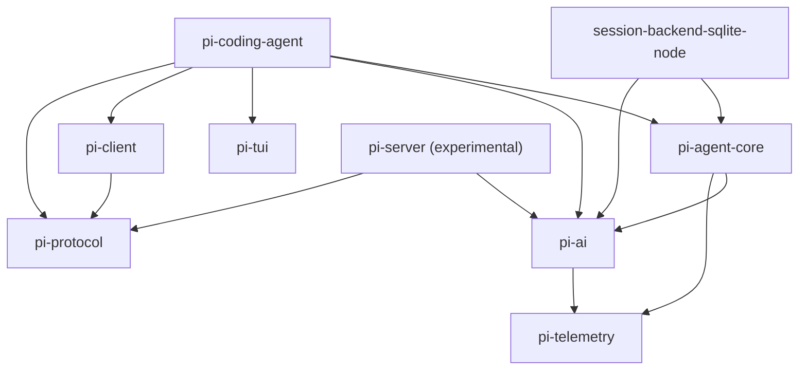
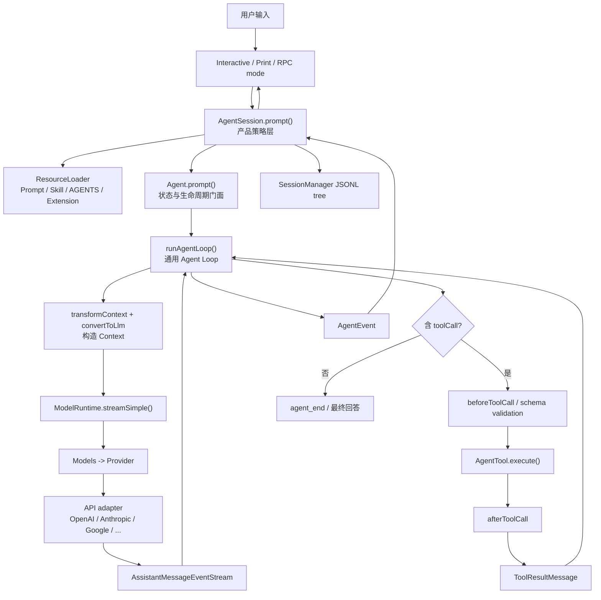
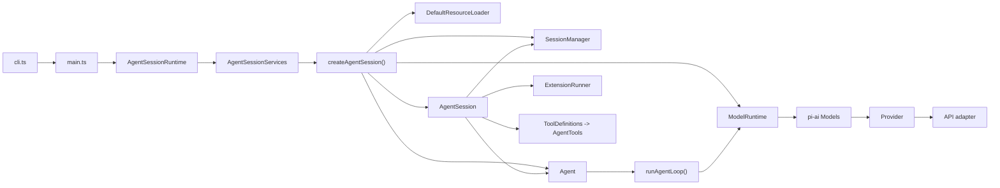

# Pi Agent 源码分析与 Python 重写设计

> 分析对象：`D:\pi`  
> 源码快照：Git `e14afc648e10fb6c527ea88fa627091ada764306`，分支 `main`  
> 分析方式：递归扫描仓库，并从实际 CLI 入口追踪到 Agent Loop、Provider、Tool、Session 和事件持久化。本文不以 README 作为架构证据，也没有修改或运行 `D:\pi`。

## 1. 项目全景

### 1.1 先给结论

Pi 不是“一个大 Agent 类”，而是三层核心加若干外围包：

1. `packages/ai`：统一不同模型供应商的消息、模型、认证和流式响应协议。
2. `packages/agent`：与具体供应商无关的通用 Agent 状态和工具循环。
3. `packages/coding-agent`：把通用 Agent 组装成真实可用的编程助手，加入 CLI/TUI、会话、工具、技能、扩展、提示词、压缩与重试。

当前 `pi` 命令的真实主链是：

```text
packages/coding-agent/src/cli.ts
  -> main.ts
  -> createAgentSessionRuntime()
  -> createAgentSession()/AgentSession
  -> Agent.prompt()
  -> packages/agent/src/agent-loop.ts
  -> ModelRuntime.streamSimple()
  -> packages/ai Provider/API adapter
```

不要把 `packages/agent/src/harness/AgentHarness` 当作现行 Coding Agent 的核心实现。它虽然已公开导出，但 `prompt()`、`steer()`、`followUp()`、`compact()`、`resume()`、`watch()` 等关键方法仍统一返回 `HarnessNotImplemented`（`packages/agent/src/harness/agent-harness.ts:305-507`）。当前 CLI 使用的是 `packages/coding-agent/src/core/agent-session.ts` 中成熟的 `AgentSession`。

### 1.2 整理后的目录树

下面不是机械列出 1134 个 TypeScript 文件，而是保留影响运行原理的目录和代表文件：

```text
D:\pi
├─ package.json                     # npm workspace、全仓构建/检查/发布编排
├─ tsconfig*.json / biome.json      # TypeScript 与格式检查配置
├─ README.md / CONTRIBUTING.md      # 文档，不是运行入口
├─ AGENTS.md                        # 仓库开发规则
├─ .github/ / .husky/               # CI、Issue 模板、Git hooks
├─ .pi/
│  ├─ extensions/                   # 本仓库开发时加载的 Pi 扩展
│  ├─ prompts/                      # 本仓库 prompt templates
│  └─ skills/                       # 本仓库技能
├─ scripts/                         # 发布、模型目录生成、依赖校验、性能脚本
└─ packages/
   ├─ ai/
   │  ├─ src/types.ts               # Message/Context/Tool/Model/流事件公共类型
   │  ├─ src/models.ts              # Provider、Models 注册表、认证后分派
   │  ├─ src/api/                    # Anthropic/OpenAI/Google 等 API 协议适配器
   │  ├─ src/providers/              # Provider 工厂与模型目录
   │  ├─ src/auth/                   # API key/OAuth/credential store
   │  └─ src/utils/event-stream.ts   # AsyncIterable 事件流
   ├─ agent/
   │  ├─ src/agent.ts               # 有状态 Agent 门面、队列、状态 reducer
   │  ├─ src/agent-loop.ts           # 真正的模型-工具循环
   │  ├─ src/types.ts                # AgentState/AgentTool/AgentEvent 等
   │  ├─ src/stream-fn.ts            # 注入模型流函数，保持核心与 Provider 解耦
   │  ├─ src/harness/                # 新一代通用 harness/session 方向，部分未实现
   │  └─ src/search/ / proxy.ts      # 搜索与代理辅助
   ├─ coding-agent/
   │  ├─ src/cli.ts                  # `pi` 可执行入口
   │  ├─ src/main.ts                 # 参数、信任、资源、会话和运行模式装配
   │  ├─ src/core/sdk.ts             # 创建 Agent + AgentSession 的组合根
   │  ├─ src/core/agent-session.ts   # 产品层核心：prompt、持久化、扩展、压缩、重试
   │  ├─ src/core/session-manager.ts # JSONL 会话树与上下文重建
   │  ├─ src/core/model-runtime.ts   # 产品层模型/认证运行时封装
   │  ├─ src/core/resource-loader.ts # skills/prompts/extensions/context/themes 加载
   │  ├─ src/core/messages.ts        # 自定义消息到 LLM Message 的投影
   │  ├─ src/core/system-prompt.ts   # 系统提示词、工具/技能/AGENTS 上下文组装
   │  ├─ src/core/extensions/        # 扩展定义、加载、事件分派与工具包装
   │  ├─ src/core/tools/             # read/bash/edit/write/grep/find/ls
   │  ├─ src/core/compaction/        # 上下文压缩与分支摘要
   │  ├─ src/modes/print-mode.ts     # 单次文本/JSON 输出
   │  ├─ src/modes/rpc/              # stdin/stdout JSON RPC 模式
   │  ├─ src/modes/interactive/      # 交互 TUI 产品层
   │  ├─ docs/ / examples/           # 用户文档与扩展示例
   │  └─ test/                       # 产品层测试
   ├─ tui/                           # 通用终端组件、布局、输入、差分渲染
   ├─ protocol/                      # 远程 Pi 会话的 CBOR schema 与帧协议
   ├─ client/                        # 远程会话客户端、连接和 session handle
   ├─ server/                        # 实验性远程 Pi server
   ├─ session-backends/sqlite-node/  # 新 harness session API 的 SQLite 后端
   ├─ telemetry/                     # 与厂商无关的 span/event 类型协议
   └─ evals/                         # 模型/Agent 评测设施
```

### 1.3 各 package 的职责与依赖地位

| package | 运行职责 | Python 第一版 |
|---|---|---|
| `@earendil-works/pi-ai` | 统一模型元数据、Provider、认证、API 请求格式和流事件 | 必须，但只实现 1 个 Provider 即可 |
| `@earendil-works/pi-agent-core` | Agent 状态、消息队列、模型调用、工具验证/执行、循环与生命周期事件 | 必须 |
| `@earendil-works/pi-coding-agent` | Coding Agent 产品逻辑、会话、资源、扩展、内置工具、CLI/TUI | 必须做精简子集 |
| `@earendil-works/pi-tui` | 终端 UI 库，不决定 Agent 推理语义 | 暂缓；先用普通 CLI |
| `@earendil-works/pi-protocol` | 远程会话命令、快照、CBOR 编码和长度帧 | 暂缓 |
| `@earendil-works/pi-client` | 远程 server 的连接、重连、租约和 session handle | 暂缓 |
| `@earendil-works/pi-server` | 实验性远程多会话服务 | 暂缓 |
| `pi-session-backend-sqlite-node` | 新 session/harness API 的 SQLite 存储 | 暂缓；先 JSONL |
| `pi-telemetry` | 类型化 telemetry 抽象 | 可留接口，先 no-op |
| `pi-evals` | 评测脚本与 Vitest 集成 | 第一版不进入运行时 |

内部 package 依赖关系由各自 `package.json` 直接给出：



### 1.4 核心、外围和可忽略边界

Python 重写必须优先理解和复刻：

- `packages/ai/src/types.ts:304-539`：统一输入输出契约。
- `packages/ai/src/models.ts:97-253,254-末尾`：Provider/Models 分派和认证边界。
- `packages/agent/src/agent-loop.ts:95-372,411-796`：真实 Agent Loop。
- `packages/agent/src/agent.ts:167-592`：状态、队列、事件归约和并发保护。
- `packages/coding-agent/src/core/sdk.ts:171-400`：组合根。
- `packages/coding-agent/src/core/agent-session.ts:377-681,1023-1273`：产品层控制。
- `packages/coding-agent/src/core/session-manager.ts:325-469,855-1089`：持久化与上下文重建。
- `packages/coding-agent/src/core/tools/`：工具 schema、执行与结果规范。

第一版可以暂时忽略：

- `src/modes/interactive/` 和整个 `packages/tui`：体量大，但不改变 Agent Loop。
- 绝大多数 Provider 与生成模型目录：只保留一个 OpenAI-compatible 或 Anthropic Provider。
- `protocol/client/server`：除非一开始就要求远程多进程。
- `evals`、`test`、`examples`、`docs`、`.github`、发布脚本和二进制构建。
- 图像缩放、剪贴板、HTML 导出、自更新、主题、OAuth UI。
- `packages/agent/src/harness/AgentHarness` 的未完成行为；可借鉴其存储接口，但不能当作已验证的产品语义照搬。

需谨慎看待的“重复代码”：`packages/agent/src/harness/tools|compaction|session` 与 `packages/coding-agent/src/core/tools|compaction|session-manager` 同时存在。当前 CLI 明确引用后者；前者代表正在抽取的通用架构方向，而不是当前 CLI 的真实执行路径。

## 2. 系统架构

### 2.1 总体架构图



### 2.2 各层实际源码映射

| 层 | 实际实现 |
|---|---|
| CLI 可执行入口 | `coding-agent/src/cli.ts:1-20` 设置环境后调用 `main()` |
| 启动/模式选择 | `coding-agent/src/main.ts:569-975` 创建 cwd 绑定服务、runtime、session，选择 RPC/TUI/print |
| 产品会话门面 | `coding-agent/src/core/agent-session.ts:305-3334` |
| 通用 Agent 门面 | `agent/src/agent.ts:173-592` |
| Agent Core Loop | `agent/src/agent-loop.ts:155-275`；模型流 `281-372`；工具执行 `411-796` |
| 消息与 Context 类型 | `ai/src/types.ts:338-539` |
| Agent 类型与事件 | `agent/src/types.ts` 中 `AgentState`、`AgentTool`、`AgentContext`、`AgentEvent` |
| 模型/Provider 分派 | `ai/src/models.ts` 的 `Provider`、`Models`、`ModelsImpl`、`createProvider()` |
| 产品模型运行时 | `coding-agent/src/core/model-runtime.ts`；在 `sdk.ts:305-332` 被注入为 `Agent.streamFn` |
| 内置工具 | `coding-agent/src/core/tools/index.ts` 与各工具文件 |
| 扩展 | `coding-agent/src/core/extensions/types.ts` + `runner.ts` + `loader.ts` |
| 会话 | `coding-agent/src/core/session-manager.ts` 的 JSONL 树 |
| 系统提示词/技能 | `system-prompt.ts`、`resource-loader.ts`、`skills.ts`、`prompt-templates.ts` |
| 输出 | `print-mode.ts`、`interactive-mode.ts`、`rpc-mode.ts` |

### 2.3 模块调用关系图



### 2.4 一次完整请求的时序图

```mermaid
sequenceDiagram
    actor User
    participant Mode as Print/TUI/RPC
    participant Session as AgentSession
    participant Ext as ExtensionRunner
    participant Agent
    participant Loop as runAgentLoop
    participant Runtime as ModelRuntime/Models
    participant Provider
    participant Tool
    participant Store as SessionManager

    User->>Mode: 输入 prompt
    Mode->>Session: prompt(text, images)
    Session->>Ext: input / before_agent_start
    Ext-->>Session: 可转换输入、追加消息、改 system prompt
    Session->>Session: 展开 /skill 和 prompt template
    Session->>Agent: prompt(UserMessage[])
    Agent->>Loop: runAgentLoop(context snapshot, config)
    Loop-->>Agent: agent_start, turn_start, message_start/end(user)
    Agent-->>Session: 转发 AgentEvent
    Session->>Store: appendMessage(user)
    Loop->>Loop: transformContext + convertToLlm
    Loop->>Runtime: streamSimple(model, Context)
    Runtime->>Provider: 认证、headers、API 分派
    Provider-->>Loop: start/text_delta/toolcall_delta/.../done
    Loop-->>Session: message_update 流事件
    Loop->>Loop: 固化 AssistantMessage
    Session->>Store: appendMessage(assistant)
    alt AssistantMessage 包含 toolCall
        Loop->>Ext: beforeToolCall(tool_call)
        Ext-->>Loop: allow / block
        Loop->>Tool: execute(id, validated args, signal, onUpdate)
        Tool-->>Loop: AgentToolResult
        Loop->>Ext: afterToolCall(tool_result)
        Ext-->>Loop: 可覆盖 content/details/isError
        Loop->>Loop: 创建 ToolResultMessage
        Session->>Store: appendMessage(toolResult)
        Loop->>Runtime: 用追加后的 Context 再次调用模型
        Runtime->>Provider: 下一轮请求
        Provider-->>Loop: 最终 AssistantMessage
    end
    Loop-->>Session: turn_end, agent_end
    Session->>Session: 重试/压缩检查
    Session-->>Mode: agent_settled
    Mode-->>User: 最终文本或事件流
```

### 2.5 数据怎样流动

1. 用户文本先被产品层转换为 `UserMessage`，不是直接传给 Provider。
2. `AgentSession` 可注入扩展自定义消息、技能正文、prompt template 和动态 system prompt。
3. `Agent` 复制当前 `systemPrompt/messages/tools` 得到 `AgentContext` 快照。
4. 每次模型调用前，`transformContext` 允许扩展改变 Agent 级消息；`convertToLlm` 再把 `bashExecution/custom/branchSummary/compactionSummary` 投影为标准 `Message[]`。
5. `Context = {systemPrompt, messages, tools}` 进入 `ModelRuntime -> Models -> Provider -> API adapter`。
6. Provider 适配器把各厂商流转换成统一 `AssistantMessageEvent`；Loop 一边更新 partial message，一边发 UI 事件。
7. 完整 assistant 消息进入 transcript。如果包含 `toolCall`，工具结果被规范化为 `ToolResultMessage`，追加到同一 transcript，再发起模型调用。
8. `AgentSession` 监听每个 `message_end`，将用户、assistant、toolResult 作为树节点追加到 JSONL。

这里存在两个不同的“上下文”：

- `AgentContext`：运行时可包含自定义 `AgentMessage`，供产品层扩展。
- `pi-ai Context`：只允许 Provider 能理解的标准 `Message[]`、system prompt 和 tool schema。

这条转换边界是 Python 重写中最值得保留的设计之一。

## 3. Agent 核心循环

### 3.1 从真实入口追踪

#### 第 1 步：CLI 进入产品会话

- `coding-agent/src/cli.ts:17-20` 调用 `main(process.argv.slice(2))`。
- `main.ts:719-845` 定义 cwd 绑定的 runtime 工厂。
- `main.ts:847-854` 创建 `AgentSessionRuntime` 并取得 `session`。
- print 模式在 `print-mode.ts:131-137` 调用 `session.prompt()`；TUI 最终也调用同一个产品 API。

#### 第 2 步：创建 Agent 与 AgentSession

`createAgentSession()` 位于 `coding-agent/src/core/sdk.ts:171-400`：

- 恢复或选择 `Model`、thinking level。
- 选出默认工具 `read/bash/edit/write`。
- `sdk.ts:297-363` 创建 `Agent`，把 `ModelRuntime.streamSimple()` 注入为 `streamFn`。
- 把 `convertToLlm`、扩展 context hook、队列模式和 Provider request hooks 注入 Agent。
- `sdk.ts:379-393` 再创建 `AgentSession`，组合 session manager、resource loader、model runtime 和 tools。

这是一种明确的依赖注入：`pi-agent-core` 不知道 OpenAI/Anthropic，也不知道文件工具；它只依赖一个 `StreamFn` 和一组 `AgentTool`。

#### 第 3 步：产品层预处理 prompt

`AgentSession.prompt()` 在 `agent-session.ts:1116-1273`：

- 先处理扩展 slash command。
- 发出扩展 `input` 事件，允许拦截或改写。
- 展开 `/skill:name` 和 prompt template。
- 若 Agent 正在运行，则按 `steer` 或 `followUp` 入队。
- 校验 model/auth，必要时先压缩历史。
- 构造 `UserMessage` 与扩展消息。
- `before_agent_start` 可改变 system prompt。
- 最终 `_runAgentPrompt()` 调用 `Agent.prompt()`。

#### 第 4 步：Agent 状态门面启动低层循环

`Agent.prompt()` 在 `agent/src/agent.ts:347-358`，字符串会规范化为：

```ts
{ role: "user", content: [{ type: "text", text }], timestamp }
```

然后：

- `runPromptMessages()`（`409-423`）创建 context/config 快照并调用 `runAgentLoop()`。
- `runWithLifecycle()`（`486-509`）设置 `isStreaming`、`AbortController`，确保一次只能有一个 active run。
- `processEvents()`（`544-590`）把事件归约到 `messages`、`streamingMessage`、`pendingToolCalls`、`errorMessage`。

#### 第 5 步：真实模型-工具循环

`runLoop()` 位于 `agent/src/agent-loop.ts:155-275`。核心状态变化如下：

| 状态 | 变化位置 | 含义 |
|---|---|---|
| `currentContext.messages` | prompt、assistant、toolResult、queued message 时追加 | 下一次模型请求的事实来源 |
| `newMessages` | 本次 run 新产生消息都追加 | `agent_end` 返回范围 |
| `pendingMessages` | steering/follow-up drain | 运行中插入用户指令 |
| `hasMoreToolCalls` | 工具批次完成后更新 | 是否立即再调用模型 |
| `config.model/reasoning` | `prepareNextTurn` 后更新 | 允许运行中换模型/思考级别 |

循环不是简单的单层 `while tool_calls`，而是：

- 内层：处理工具调用和 steering 消息。
- 外层：Agent 本来准备结束时，再检查 follow-up 消息。

#### 第 6 步：构造 Context 并调用 LLM

`streamAssistantResponse()` 在 `agent-loop.ts:281-372`：

1. `transformContext(AgentMessage[])`。
2. `convertToLlm()` 得到标准 `Message[]`。
3. 构造 `pi-ai Context`。
4. 动态解析 API key。
5. 调用注入的 `streamFunction(model, context, options)`。
6. 消费 `AssistantMessageEventStream`，用 partial message 替换 transcript 尾部。
7. 收到 `done/error` 后返回完整 `AssistantMessage`。

`StreamFn` 的契约要求运行错误尽量编码成流中的 `error` 终止事件，而不是 reject；因此上层仍能得到完整的 `message_end -> turn_end -> agent_end` 生命周期。

#### 第 7 步：判断并执行工具

`runLoop()` 在 `agent-loop.ts:202-222` 直接过滤：

```ts
message.content.filter(c => c.type === "toolCall")
```

因此控制依据是内容中的 tool-call block，而不是只看 stop reason。执行路径：

1. `executeToolCalls()`（`411-426`）决定顺序或并行。
2. `prepareToolCall()`（`600-668`）查找工具、准备兼容参数、按 TypeBox schema 校验、执行 `beforeToolCall`。
3. `executePreparedToolCall()`（`670-711`）调用 `tool.execute()`，并把 partial result 变成 `tool_execution_update`。
4. `finalizeExecutedToolCall()`（`713-758`）执行 `afterToolCall`，允许扩展覆盖结果。
5. `createToolResultMessage()`（`777-790`）把结果转成标准消息。
6. 结果按 assistant 中的原始 tool-call 顺序追加到上下文，然后再次调用模型。

并行模式有一个细节：工具可并发完成，`tool_execution_end` 按完成顺序发出，但写入 transcript 的 `ToolResultMessage` 保持 assistant 源顺序（`agent-loop.ts:489-553`）。这能兼顾 UI 实时性和稳定上下文顺序。

如果 assistant 因 token limit 以 `stopReason="length"` 结束，所有工具调用都不会执行，因为其 JSON 参数可能被截断；Loop 会为每个调用生成错误结果，让模型重发（`agent-loop.ts:374-405`）。

### 3.2 关键类型、参数和返回值

| 符号 | 输入 | 返回 | 责任 |
|---|---|---|---|
| `Agent.prompt()` | string / `AgentMessage` / 数组 | `Promise<void>` | 启动一次有状态 run |
| `runAgentLoop()` | prompts、`AgentContext`、`AgentLoopConfig`、emit、signal、streamFn | `Promise<AgentMessage[]>` | 生命周期和循环 |
| `StreamFn` | `Model`、`Context`、options | `AssistantMessageEventStream` | Provider 边界 |
| `AgentTool.execute()` | call id、已校验参数、abort signal、update callback | `Promise<AgentToolResult>` | 工具副作用 |
| `AgentToolResult` | content/details/usage/terminate | — | 工具内部结果 |
| `ToolResultMessage` | toolCallId/name/content/isError/timestamp | — | 可进入 LLM transcript 的结果 |
| `AgentLoopConfig` | 模型、转换器、hooks、队列读取器、执行模式 | — | Loop 的可插拔策略 |

### 3.3 简化 Python 伪代码

下面保留 Pi 的关键语义，但删除 TUI、扩展 UI、自动重试和复杂并行调度：

```python
async def run_agent(
    prompt_messages: list[AgentMessage],
    state: AgentState,
    provider: Provider,
    emit: EventSink,
) -> list[AgentMessage]:
    new_messages = list(prompt_messages)
    state.messages.extend(prompt_messages)
    await emit(AgentStarted())

    pending = await state.steering_queue.drain()

    while True:  # follow-up loop
        need_model_call = True

        while need_model_call or pending:  # tool/steering loop
            for message in pending:
                state.messages.append(message)
                new_messages.append(message)
                await emit(MessageCompleted(message))
            pending = []

            agent_messages = await transform_context(state.messages)
            llm_messages = convert_to_llm(agent_messages)
            context = Context(
                system_prompt=state.system_prompt,
                messages=llm_messages,
                tools=[tool.spec for tool in state.tools.values()],
            )

            assistant = None
            async for event in provider.stream(state.model, context):
                assistant = reduce_stream_event(assistant, event)
                await emit(event)

            assert assistant is not None
            state.messages.append(assistant)
            new_messages.append(assistant)

            if assistant.stop_reason in {"error", "aborted"}:
                await emit(AgentEnded(new_messages))
                return new_messages

            calls = [part for part in assistant.content
                     if isinstance(part, ToolCall)]
            tool_results: list[ToolResultMessage] = []

            for call in calls:
                tool = state.tools.get(call.name)
                if tool is None:
                    result = ToolResult.error(call, "tool not found")
                else:
                    args = tool.input_model.model_validate(call.arguments)
                    decision = await before_tool_call(call, args)
                    if decision.block:
                        result = ToolResult.error(call, decision.reason)
                    else:
                        try:
                            raw = await tool.execute(args)
                            result = await after_tool_call(call, raw)
                        except Exception as exc:
                            result = ToolResult.error(call, str(exc))

                message = result.to_message(call)
                tool_results.append(message)
                state.messages.append(message)
                new_messages.append(message)
                await emit(MessageCompleted(message))

            await emit(TurnEnded(assistant, tool_results))
            need_model_call = bool(calls)
            pending = await state.steering_queue.drain()

        pending = await state.follow_up_queue.drain()
        if not pending:
            break

    await emit(AgentEnded(new_messages))
    return new_messages
```

第一版 Python 实现建议先顺序执行工具。并行工具、steering/follow-up 和动态 `prepareNextTurn` 都应在基本闭环验证后再加。

## 4. 核心概念

### 4.1 Message

`pi-ai` 的标准 `Message` 是三个判别联合（`ai/src/types.ts:409-455`）：

- `UserMessage`：文本或图像输入。
- `AssistantMessage`：文本、thinking、tool call，以及 provider/model/usage/stopReason。
- `ToolResultMessage`：用 `toolCallId` 与调用配对，携带文本/图像、错误状态和 details。

产品层 `AgentMessage` 更宽。`coding-agent/src/core/messages.ts` 通过 TypeScript declaration merging 增加 `bashExecution/custom/branchSummary/compactionSummary`。只有在 Provider 边界，`convertToLlm()` 才把这些自定义消息投影成标准 `Message`。

### 4.2 Context

`pi-ai Context`（`ai/src/types.ts:509-513`）很小：system prompt、标准消息、tool schemas。`AgentContext`（`agent/src/types.ts`）保留 `AgentMessage[]`。Session context 又是从当前 JSONL 树叶节点反向追踪、应用最新 compaction 后生成的活动分支。

关系是：

```text
Session entries -> active branch -> AgentMessage[]
-> transformContext -> convertToLlm -> Message[]
-> pi-ai Context -> Provider
```

### 4.3 Model

`Model<TApi>`（`ai/src/types.ts:794-823`）是声明性元数据：id、provider、api 协议、base URL、是否支持 reasoning、输入类型、价格、context window、max tokens 和兼容选项。它不是网络客户端，也不负责认证。

### 4.4 Provider

`Provider`（`ai/src/models.ts:97-154`）才是运行单元：拥有 provider id/name、认证策略、模型列表和 `stream/streamSimple`。`ModelsImpl` 是 Provider 注册表和统一入口：先查 Provider、解析 credential/header/base URL，再委派流请求。

`createProvider()` 把 Provider 元数据、认证、模型目录与 API adapter 组合起来。比如 `providers/anthropic.ts` 只声明 Anthropic 认证、模型和 `anthropicMessagesApi()`。

### 4.5 Tool、Tool Call、Tool Result

- `Tool`：发给模型的只读声明，只有 name/description/parameters。
- `AgentTool`：在 Tool 之上增加 label、`execute()`、参数兼容和执行模式。
- `ToolDefinition`：Coding Agent 的更丰富产品定义，额外包含 prompt contribution、TUI renderer 和扩展 context。
- `ToolCall`：模型输出中的 `{id, name, arguments}` 内容块。
- `AgentToolResult`：工具执行函数内部返回值。
- `ToolResultMessage`：转换后进入会话和下一次 LLM Context 的标准消息。

Python 中应保持“tool spec”与“tool implementation”可分离，以便 Provider 只看到 schema，执行器持有真正副作用代码。

### 4.6 Agent State

`AgentState` 保存 system prompt、model、thinking level、tools、messages，以及只读运行态 `isStreaming/streamingMessage/pendingToolCalls/errorMessage`。`Agent.processEvents()` 是状态归约器：Loop 发事件，Agent 根据事件改变状态，再通知订阅者。

这避免让 Provider、工具和 UI 直接互相写状态。

### 4.7 Session

现行 Coding Agent 使用 `SessionManager` 的 append-only JSONL 树：每个 entry 有 `id/parentId/timestamp`，当前 `leafId` 表示活动分支。模型/思考级别变化、消息、压缩、分支摘要、扩展状态都作为 entry 追加。

`buildSessionContext()`（`session-manager.ts:461-469`）从 leaf 回溯到 root；若有 compaction，就用摘要替换更早的历史。它不是简单的聊天消息数组，因此能支持 fork、tree navigation 和 branch summary。

### 4.8 Event 与 Streaming

有两层事件：

- `AssistantMessageEvent`：Provider 流协议，包含 start、text/thinking/toolcall 的 start/delta/end，以及 done/error。
- `AgentEvent`：产品可观察生命周期，包含 agent、turn、message、tool execution 的 start/update/end。

`EventStream<T,R>`（`ai/src/utils/event-stream.ts`）同时实现 `AsyncIterable<T>` 和 `result(): Promise<R>`：消费者可实时迭代，也可等待最终消息。Python 可用 async generator 加一个结果 future，或更简单地让 async generator 的最终 `done` 事件携带完整消息。

### 4.9 Extension

Extension 是运行时代码插件，不只是提示词。`ExtensionAPI` 可注册工具、命令、Provider、快捷键和大量 hook。重要介入点包括：

- 输入：`input`、`before_agent_start`。
- Context/请求：`context`、`before_provider_request`、`before_provider_headers`。
- Agent 生命周期：agent/turn/message/tool execution 事件。
- 工具策略：`tool_call` 可阻止调用，`tool_result` 可改写结果。
- 会话：start/shutdown/switch/fork/compact/tree。

Python 第一版不应复刻完整 Extension API。先设计一个小 `HookRegistry`，仅支持 `before_model_request`、`before_tool_call`、`after_tool_call`、`on_event`。

### 4.10 Skill

Skill 是带 YAML frontmatter 的 `SKILL.md`。资源加载器只把 name、description、location 放入 system prompt，模型匹配到任务后用 read 工具按需读取正文；显式 `/skill:name args` 则由 `AgentSession` 直接读正文并包进 `<skill>` 块。`disable-model-invocation` 可禁止模型自动发现，只允许显式调用。

所以 Skill 是“可发现、按需加载的提示词资源”，不是可执行插件。

### 4.11 Prompt

Pi 有三种容易混淆的 prompt：

1. System prompt：由工具、AGENTS/CLAUDE context files、skill 索引和追加文本构建。
2. Prompt template：Markdown 文件，可用 `/name args` 展开 `$1/$@/${N:-default}`。
3. User prompt：实际进入消息历史的用户输入。

Extension 的 `before_agent_start` 还能逐 turn 覆盖 system prompt。

### 4.12 Memory

现行源码没有独立的向量数据库、embedding 检索或长期语义记忆模块。“记忆”由以下机制共同形成：

- JSONL session transcript 和活动分支。
- compaction summary 和 branch summary。
- AGENTS/CLAUDE 项目上下文文件。
- skills/prompt templates。
- Extension 自定义 entry（其中 plain custom entry 不进入 LLM context）。

`packages/agent/src/harness/session/memory.ts` 名称中的 memory 指 `InMemorySessionStorage/InMemorySessionRepo`，是内存存储后端，不是语义记忆。Python 第一版不要因此引入向量库。

### 4.13 TUI / CLI

CLI 决定启动模式；`main.ts` 最终选择：

- interactive：`InteractiveMode` + `pi-tui`，实时订阅 AgentSessionEvent。
- print：依次 `session.prompt()`，最后打印 assistant text。
- json：输出所有事件的 JSONL。
- rpc：stdin/stdout 控制会话。

UI 是事件消费者。它不应拥有 Agent Loop，也不应成为 Python 核心包的依赖。

## 5. TypeScript -> Python 映射与重新设计

### 5.1 语言构造映射

| TypeScript | Python 推荐 | 说明 |
|---|---|---|
| `interface` 数据结构 | `@dataclass(slots=True)` 或 Pydantic model | 内部可信对象优先 dataclass；外部 JSON 边界用 Pydantic |
| 行为接口 | `typing.Protocol` | Provider、Tool、EventSink、SessionStore |
| 判别联合 `type` | `A | B | C` + `Literal` | 用 `match` 做穷尽分派 |
| generic | `TypeVar` / `Generic` | 仅在 Provider/Tool result 真正带来静态收益时使用 |
| TypeBox/Zod schema | Pydantic `BaseModel` + JSON Schema | 同一模型完成参数校验和发给 LLM 的 schema |
| `AsyncIterable` | `AsyncIterator` / async generator | Provider 流和事件订阅 |
| `EventEmitter`/listener set | `EventBus` + async callbacks | 规定串行还是并行，默认串行保证顺序 |
| `AbortController` | `asyncio.Event` 或 task cancellation | Python 更适合直接取消 Task；工具要传播 `CancelledError` |
| `Map`/`Set` | `dict`/`set` | Tool/Provider registry |
| declaration merging | 显式注册 codec/projector | 不依赖魔法扩展类型 |
| npm workspace package | Python package/module | 先单一发行包，内部清晰分层，不急于拆多个 wheel |

### 5.2 推荐的 Python 包结构

```text
pi_python/
├─ pyproject.toml
├─ src/pi_agent/
│  ├─ domain/
│  │  ├─ content.py          # Text/Image/Thinking/ToolCall
│  │  ├─ messages.py         # User/Assistant/ToolResult
│  │  ├─ events.py           # ProviderEvent/AgentEvent
│  │  └─ models.py           # Model metadata
│  ├─ providers/
│  │  ├─ base.py             # Provider Protocol
│  │  └─ openai_compatible.py
│  ├─ tools/
│  │  ├─ base.py             # ToolSpec + Tool Protocol
│  │  ├─ read.py
│  │  ├─ shell.py
│  │  ├─ edit.py
│  │  └─ write.py
│  ├─ core/
│  │  ├─ loop.py             # 唯一模型-工具循环
│  │  ├─ agent.py            # 状态、队列、取消、事件
│  │  ├─ context.py          # AgentMessage -> Provider Message
│  │  └─ hooks.py            # 最小 hook registry
│  ├─ session/
│  │  ├─ entries.py
│  │  ├─ store.py            # SessionStore Protocol
│  │  └─ jsonl.py
│  ├─ resources/
│  │  ├─ loader.py
│  │  ├─ skills.py
│  │  └─ prompts.py
│  ├─ app/
│  │  └─ coding_session.py   # 对应精简 AgentSession
│  └─ cli.py
└─ tests/
   ├─ test_agent_loop.py
   ├─ test_tool_errors.py
   ├─ test_stream_reducer.py
   └─ test_session_jsonl.py
```

### 5.3 应保留的设计

- Provider 与 Agent Loop 通过流接口解耦。
- AgentMessage 与 Provider Message 分层。
- Tool schema、执行实现、ToolResultMessage 三段分离。
- 事件驱动状态更新，让 CLI/TUI 只是观察者。
- append-only session entry 和活动 leaf，支持以后加 fork/compaction。
- 错误也变成完整 assistant/tool-result 消息，使历史可重放、UI 生命周期完整。
- 参数先校验、再 hook、再执行；任何未知工具和执行异常都返回 tool result，而不是让 Loop 崩溃。

### 5.4 应简化或推迟的设计

- 第一版只支持一个 Provider 和一种统一 API，不复制几十个 adapter。
- 工具先串行执行，避免文件写并发和结果排序复杂度。
- 先只有普通 CLI + JSON event 输出，不做全屏 TUI。
- 先无 OAuth、remote server、CBOR、SQLite、telemetry exporter。
- Extension 只保留 3-4 个核心 hook，不复刻 UI/快捷键/Provider 动态注册。
- Skill 只做目录发现、索引进 system prompt、按需读取。
- Compaction 作为第二阶段功能；但 session entry 格式从一开始预留 `summary` 类型。
- 不实现独立向量 Memory，除非后续需求明确要求跨项目语义检索。

### 5.5 建议的实现顺序与验收点

1. **领域模型与假 Provider**：能用固定事件流还原 assistant text/tool call。
2. **最小 Agent Loop**：用户消息 -> 模型 -> 工具 -> tool result -> 模型 -> 最终文本；用 fake provider 单测闭环。
3. **四个 Coding Tool**：read/shell/edit/write，Pydantic 参数校验，错误均转成 ToolResultMessage。
4. **Agent 状态与事件**：流式 partial、取消、pending tools、事件顺序可测试。
5. **JSONL Session**：写入 message entries，重启可恢复活动上下文。
6. **真实 Provider**：接一个 API，验证文本、tool call、错误、取消四条路径。
7. **资源层**：system prompt、AGENTS、skills、prompt templates。
8. **第二阶段**：compaction、steering/follow-up、并行只读工具、扩展 hooks、TUI/remote。

最关键的端到端验收用例是：

```text
用户：读取 demo.txt 并告诉我第一行
模型：toolCall(read, {path: "demo.txt"})
Agent：校验并执行 read
会话：追加 ToolResultMessage
模型：根据工具结果生成最终文本
重启：JSONL 恢复后仍能看到完整 user -> assistant(toolCall) -> toolResult -> assistant 链
```

只要这条链稳定，Python 重写就已经拥有 Pi 的核心；TUI、多 Provider、扩展市场和远程协议都是在这条链外侧逐层增加的能力。
