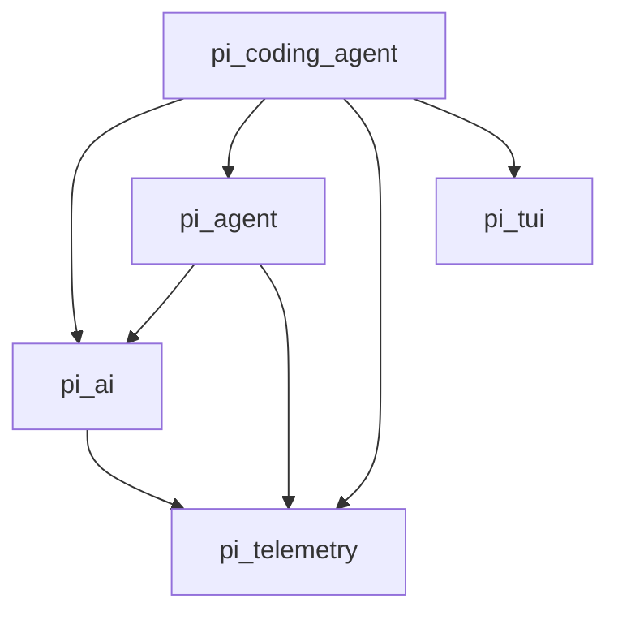

# ADR 0002：单 wheel 与内部 package 依赖边界

- 状态：Accepted
- 日期：2026-08-15
- 决策者：Pi Python 重写项目

## 背景

上游用多个 npm package 表达层次边界，但这些 package 始终以相同版本协同发布，并互相使用精确的同系列依赖。Python 重写若立即拆成多个 distribution，会引入版本组合、发布顺序、跨包锁文件和用户安装失败模式；若完全合并成一个平面模块，又会丢失最重要的架构约束。

## 决策

项目发布一个名为 `pi-python` 的 distribution、一个 wheel、一个根 `pyproject.toml` 和一个 `uv.lock`。wheel 内保留五个可独立导入的 Python package：

```text
src/
├── pi_telemetry/
├── pi_ai/
├── pi_agent/
├── pi_tui/
└── pi_coding_agent/
```

依赖方向固定为：



硬性规则：

- `pi_telemetry` 不导入任何其他项目 package。
- `pi_ai` 只可导入 `pi_telemetry`。
- `pi_agent` 只可导入 `pi_ai` 与 `pi_telemetry`。
- `pi_tui` 是通用终端层，不导入任何其他 `pi_*` package；产品级 telemetry
  由 `pi_coding_agent` 组合，避免通用组件获得隐式产品依赖。
- `pi_coding_agent` 是唯一产品组合层，可以导入其余四个 package。
- 公共领域对象由较低层拥有；高层不得重新定义形状相似但不兼容的 Message、Event 或 Tool 类型。
- 内部 package 不单独声明版本；distribution 版本是唯一版本。
- console script 名称为 `pi-python`，不占用上游 `pi`。

## 源码证据

- 上游 `pi-agent-core` 依赖同版本 `pi-ai` 与 `pi-telemetry`：`D:\pi\packages\agent\package.json:L37-L40 @ e14afc648`。
- 上游 `pi-coding-agent` 组合 Agent、AI、client、protocol 和 TUI：`D:\pi\packages\coding-agent\package.json:L45-L50 @ e14afc648`。
- 上游 TUI 的生产依赖只有显示/Markdown 类库，不依赖 Agent 或 AI：`D:\pi\packages\tui\package.json:L47-L50 @ e14afc648`。
- 上游 AI 主入口刻意声明 core side-effect free，并将 provider factory/API implementation 放在子路径：`D:\pi\packages\ai\src\index.ts:L4-L9 @ e14afc648`。
- 当前 Python 构建已经把五个 package 放进同一 wheel：`pyproject.toml:[tool.hatch.build.targets.wheel]`。

## 备选方案

### 五个独立 distribution

暂不采用。它保留了 npm 的发布形态，却在 Python 1.0 前增加了不必要的版本矩阵和发布事务。

### 单一 `pi` package，所有代码平铺

拒绝。它会让依赖环和 UI/Agent 耦合在实现早期就变得不可见。

### namespace package

暂不采用。当前没有多个发行物共同拥有同一 namespace 的需求。

## 结果

- 好处：安装和回滚是一个事务，仍可通过 import-boundary 测试守住架构。
- 代价：用户不能只安装某一层；wheel 会包含暂时用不到的 TUI 或 SDK 代码。
- 未来拆包条件：只有在 1.0 后出现独立发布节奏或真实的轻量安装需求时，才通过新 ADR 拆分 distribution。
