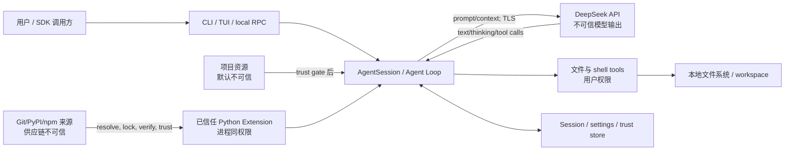

# Pi Python 1.0 威胁模型

> 基线：`e14afc648`；最后审查：2026-08-15。
> 本文描述 1.0 的安全边界、强制控制、验证方式和明确残余风险。它不是“Agent 很聪明所以会安全”的承诺。

## 1. 范围与安全目标

范围内：CLI/TUI/SDK、本地 JSONL RPC、DeepSeek Provider、七个内建工具、Settings/Resource/Package/Extension、v3 Session 与 HTML export。

安全目标：

1. API key 不进入 Session、ToolResult、日志、RPC state、错误文本或工具子进程环境；唯一受控输出是用户显式调用 `auth print-api-key` 时的 stdout。
2. 未信任项目在用户决策前不能影响 prompt、settings、代码加载、包安装或 Extension 执行。
3. 模型输出始终是不可信数据；只有通过 tool lookup、schema、hook 和运行控制后才执行。
4. 文件 mutation 要么完整提交，要么不改变目标；并发 alias 不得造成部分覆盖。
5. abort/timeout 后不留下仍向 Agent 发送事件的工具进程。
6. Session 损坏不被静默吞掉；恢复不会自动重放可能有副作用的工具。
7. 远程包来源在信任、锁定和禁 lifecycle script 的边界内处理。
8. JSON/RPC/stdout 保持协议纯净，所有外部文本在 HTML/TUI 边界安全渲染。

不作保证：核心默认不是 OS sandbox；不承诺工具副作用 exactly-once；不防御已获得用户账号/文件权限的本机恶意进程；不防御用户明确信任并加载的恶意 Python Extension。

## 2. 资产

| 资产 | 影响 |
|---|---|
| `DEEPSEEK_API_KEY` 与 Provider headers | 泄漏可产生费用、数据访问或账号滥用 |
| workspace 与 cwd 外可访问文件 | 删除、篡改、泄密 |
| shell/子进程权限 | 任意本机命令、网络和持久化 |
| prompt、context 与附件 | 私有代码/数据发往模型或恶意指令注入 |
| `.pi-python` 用户/项目资源 | 持久化配置、代码执行、供应链入口 |
| Session v3 JSONL | 对话隐私、未来工具决策、恢复状态 |
| stdout JSON/RPC framing | 调用方完整性和自动化可靠性 |
| Extension/package lock 与 trust store | 决定后续是否加载代码及其版本 |

## 3. 信任边界

关键边界：

- 模型响应跨越远程不可信边界；Provider 成功不表示内容安全。
- project trust 是“是否加载项目资源”的边界，不是工具 sandbox，也不是对每个 Tool Call 的许可。
- Python Extension 一旦被信任并导入，就与主进程等权限；prompt 不是 Extension 隔离机制。
- local RPC 的 stdin 调用方可驱动 Agent；只应暴露给与当前用户同等可信的本机进程。

上游边界证据：项目 trust 提示明确包含 settings/resources/package install/Extension execution（`D:\pi\packages\coding-agent\src\core\project-trust.ts:L21-L26 @ e14afc648`）；上游 bash 直接调用本机 operations（`packages\coding-agent\src\core\tools\bash.ts:L62-L88,L322-L339`）。

## 4. 攻击者与入口

- 恶意或被攻陷的仓库：AGENTS/CLAUDE、`.agents/skills`、`.pi-python` settings/prompt/theme/extension/package declaration。
- Prompt injection：用户文件、网页内容、工具输出或模型自身诱导读取 secret、运行 shell、扩大任务范围。
- 恶意/被接管的 Git、PyPI、npm package，或合法 package 的恶意新版本。
- 篡改/截断的 Session、settings、trust store 或 RPC frame。
- 本机同用户进程观察 argv、环境、临时文件或 stdout。
- Provider/network 故障、异常 SSE、partial JSON、超长输出、重复事件。
- 用户误操作：错误 cwd、信任过宽父目录、危险 shell、把 secret 放进 prompt。

## 5. 威胁与控制

### 5.1 API key

| 边界/威胁 | 强制控制 | 验证 |
|---|---|---|
| CLI argv 可被同用户进程/历史观察 | `--api-key` 仅作为显式便利入口并显示风险；文档推荐 env 或受保护 `.env`；key 不回显 | subprocess 读取自身错误/帮助/日志，断言 key 不出现 |
| 用户需要把 key 交给外部 client | 仅显式专用命令 `auth print-api-key` 可输出；stdout 精确为 key 加换行；Session/log/stderr/JSON/RPC/text Agent 输出仍禁止 | 显式命令 stdout 精确匹配；相同 credential 经所有其他入口均被 redaction |
| `.env` 被祖先仓库投毒或执行 shell 语法 | 只读显式 `--env-file` 或 final cwd 的 `.env`；不搜索祖先；只解析 `DEEPSEEK_API_KEY`；不执行 substitution；不写入 `os.environ` | 恶意 `$(...)`、`export`、重复 key、symlink、祖先 `.env` fixture |
| Provider header/payload 被日志、异常、RPC 泄漏 | `SecretStr`/专用 credential object；全局 redactor 处理 key、Bearer、常见 header；exception `repr` 不含 key；RPC state 不含 credential | secret corpus 注入 Provider error、timeout、Extension error、JSON/RPC 输出 |
| bash/tool 读取继承环境中的 key | 构造 tool child env 时删除 Provider credential 名与 Authorization；`.env` key从不进入进程 env | bash `env`/Python child 枚举环境，断言无 key |
| trusted Extension 从 Provider hook 读取 header | 只有 trust gate 后可加载；安装/启用 UI 明示 Extension 是进程同权限；无安全隔离承诺 | 未信任 Extension 零 import；信任提示快照；恶意 fixture 仅在明确 trusted 时运行 |
| key 被持久化 | 内核不创建 `auth.json`；Session/Settings model 禁止 credential 字段；写前 secret scan/redaction | fresh HOME 运行后递归扫描；Session round-trip secret test |

残余风险：用户明确使用 `--api-key` 时，操作系统可能向同用户进程暴露 argv；已信任 Python Extension 可以读取主进程内存/环境或自行访问文件。

冻结源码依据：DeepSeek 环境变量是 `DEEPSEEK_API_KEY`（`D:\pi\packages\ai\src\env-api-keys.ts:L88-L123 @ e14afc648`）；上游存在 `auth.json` 持久化（`packages\coding-agent\src\core\auth-storage.ts:L27-L38`），Python 选择不同设计。

### 5.2 本地文件与路径

| 边界/威胁 | 强制控制 | 验证 |
|---|---|---|
| 模型通过相对/绝对/`..` 访问敏感文件 | 工具说明和 TUI 显示解析后的目标；可选 permission Extension；审计每次 tool name/path。核心保持上游宽权限，不虚构 sandbox | cwd 内/外路径、`..`、drive/UNC fixture；permission Extension allow/deny |
| symlink/junction/大小写 alias 绕过并发保护 | mutation 前 canonicalize；以 canonical target 为 mutation queue key；临提交前复核 parent/target | symlink swap、Windows case alias、两个相对 alias 并发 edit/write |
| edit/write 失败留下半文件 | 同目录临时文件、flush、原子 replace；精确 old text/唯一/不重叠；保留 BOM/换行 | fault injection 在 create/write/fsync/replace；目标 hash 要么旧要么新 |
| read/grep/find 输出导致内存/上下文 DoS | line/byte/result 上限；read/grep/find/ls head truncation；bash tail truncation并把完整输出放受限 temp | 巨型文件、超长单行、百万结果、Unicode 边界 |
| 临时完整 shell 输出泄密或长期残留 | temp 使用用户私有目录、随机不可预测名、`0600`、session shutdown/TTL cleanup；只在明确 tool result 中给路径 | 权限、cleanup、崩溃后 TTL 测试 |

残余风险：默认无 workspace sandbox，Agent 在当前用户权限下可以访问 cwd 外路径。permission gate 默认关闭，因此用户必须把任务范围和运行账号当作主要边界。

### 5.3 Shell

| 边界/威胁 | 强制控制 | 验证 |
|---|---|---|
| 模型构造任意命令、网络访问或持久化 | bash 是明确的高风险 Tool；system prompt 不等于安全边界；TUI 展示完整命令；可选逐工具 permission Extension | permission block 产生 error ToolResult，执行计数为零 |
| command injection 到外层 launcher | 只有命令正文交给用户配置的 bash；shell executable/argv 用数组启动，不拼接 launcher command；`shellCommandPrefix` 只来自可信 settings | 含引号、换行、Unicode、metacharacter 的 launcher 测试 |
| timeout/abort 留下子孙进程或迟到 update | process group/job object；timeout/abort kill tree；await 回收；execute settle 后忽略 update | fork child/grandchild、SIGINT、timeout、快速 abort；无残留 pid/迟到 event |
| 无限输出/挂起 | 无默认 timeout保持兼容，但支持每 call timeout、全局 abort和 output accumulator 上限 | 无输出 hang、持续 stdout/stderr、达到上限后仍正确回收 |
| shell 继承 key/内部控制 env | 构造最小必要 env，过滤 Provider secret；仅注入无 secret 的 `PI_*` session/model metadata | child env snapshot 和 redaction |

残余风险：没有 OS sandbox 时，成功启动的 shell 拥有当前用户全部权限；进程终止也不能回滚已完成的外部副作用。

### 5.4 模型输出与 Tool Call

| 边界/威胁 | 强制控制 | 验证 |
|---|---|---|
| prompt injection 诱导越权/secret exfiltration | 所有模型文本仅是建议；只有注册工具可执行；schema、project trust、可选 permission gate 是代码边界 | 恶意文件内容要求读 key/改系统文件；断言没有隐式动作 |
| unknown tool/无效参数/partial JSON | unknown -> error ToolResult；Pydantic strict；prepare 后验证；Extension mutation 后再验证 | unknown、wrong type、extra、partial JSON、mutation invalidation |
| output token limit 截断但参数“碰巧可解析” | Assistant `stopReason=length` 时该消息全部 Tool Call 不执行，各自返回 error | 截断单/多 tool call，tool execution count=0 |
| 重复/乱序/终止后 Provider event | 12-event 状态机验证；恰好一个 terminal；终止后事件拒绝；bounded partial buffer | malformed SSE、重复 start/done、delta before start、post-terminal delta |
| 无界 Agent loop/工具风暴 | max rounds、context/token limits、abort；达到上限产生明确终止结果 | FakeProvider 无限 tool call 与 token overflow |
| tool update 在完成后污染 UI/Session | callback 只在 execute pending 时接受；settle 后丢弃 | late callback race |

冻结源码已经把 unknown/validation/execute failure 转为 error ToolResult，并拒绝执行 length-truncated calls：`D:\pi\packages\agent\src\agent-loop.ts:L375-L406,L600-L708 @ e14afc648`。

### 5.5 项目资源

| 边界/威胁 | 强制控制 | 验证 |
|---|---|---|
| 恶意 `.pi-python` settings/Extension/package 自动执行 | 启动 bootstrap 先用 `project_trusted=false`；trust 决策后重新加载；拒绝时项目资源零参与 | import sentinel、network/spawn sentinel、settings precedence fixture |
| AGENTS/CLAUDE/Skill/Prompt 注入模型 | Python 把所有项目 context 也纳入 trust gate；显示来源/provenance；`--no-context-files` 可禁用 | 未信任 prompt snapshot 不含项目文本；信任后顺序确定 |
| theme/Markdown/HTML 注入控制序列或脚本 | theme schema；TUI ANSI sanitizer；Markdown/HTML escaping；export 不执行资源内脚本 | ANSI/OSC、HTML tags、`javascript:`、malformed theme corpus |
| trust 父目录范围过宽/路径 alias | canonical real path 存储；UI 显示精确 path；parent trust 是独立明确选项；锁内原子写 trust store | symlink/drive case、父子 decision、并发 writer、损坏 trust.json |
| `--approve` 被误解为工具批准 | help、trust dialog 和 docs 固定说明“仅 project resources”；permission Extension 另行命名 | CLI help snapshot、用户文档测试 |

上游在 trust 前先强制 project settings 为 false 再 reload（`D:\pi\packages\coding-agent\src\core\resource-loader.ts:L376-L405 @ e14afc648`）；Python 进一步把项目 context 文本也纳入 gate。

### 5.6 远程 Extension 包

| 边界/威胁 | 强制控制 | 验证 |
|---|---|---|
| package install scripts 在信任前执行 | 未信任项目不安装；PyPI 使用隔离 env/锁；npm 只 `pack`/提取数据并禁 lifecycle scripts；不执行 JS/TS | 恶意 preinstall/postinstall package sentinel 必须为零 |
| 浮动版本/branch 被替换 | lock 记录 PyPI exact version+hash、Git commit、npm tarball integrity；正常启动只用 lock；update 是显式命令 | registry/Git fixture 改动后普通启动 hash 不变，update 才改变 |
| dependency confusion/typosquat | 保存 canonical source URL/index/owner；安装确认显示解析结果；禁止把本地名静默解析为公网包 | 相同名字多 index、URL redirect、大小写/Unicode package 名 |
| archive path traversal/symlink escape | 解包前逐 entry 验证 normalized destination 位于 staging root；拒绝 absolute/`..`/device/symlink escape | zip/tar slip corpus |
| trusted Extension 崩溃或保留 stale callback | handler error isolation；runtime generation/invalidation；reload/shutdown 自动取消 task/订阅；资源有 teardown timeout | throw/hang/reload/stale callback/event bus subscription fixture |
| Extension 读取 key/任意文件 | 启用时明确声明进程同权限；只有明确 trusted 才 import；1.0 不承诺 sandbox | 未信任零 import；trusted 恶意 fixture 证明风险边界而非假装阻止 |

上游 managed npm install 默认会调用 package manager install（`D:\pi\packages\coding-agent\src\core\package-manager.ts:L1758-L1784 @ e14afc648`）；Python 禁 script 是有意分歧。

### 5.7 Session、RPC 与导出

| 边界/威胁 | 强制控制 | 验证 |
|---|---|---|
| truncated/malformed JSONL 被静默当成有效历史 | v3 strict codec；任一 malformed/unknown/orphan/duplicate 拒绝；失败原文件 hash 不变 | 每个 corrupt corpus + byte identity |
| 恶意 session id/path 覆盖任意文件 | session id regex；exclusive create；显式 path normalize；默认 session root 碰撞检查 | `../`、separator、reserved name、symlink、existing file |
| crash 后自动重放有副作用工具 | 恢复只补 error ToolResult，固定文本 `Tool execution state is unknown after session recovery; the tool was not replayed.`；不调用 registry/hook | 模拟 assistant 落盘、tool side effect、无 result；连续恢复执行计数 0、补写 1 |
| Session 泄漏 prompt/代码/Tool output | 私有目录/文件权限；默认不上传；导出是显式动作；日志不复制全文 | POSIX mode/Windows ACL best effort、fresh HOME 扫描 |
| Session 内容注入 HTML/terminal | HTML escape + strict CSP/无 inline untrusted script；TUI 控制序列 sanitize | XSS/ANSI/OSC corpus，在真实 browser/MemoryTerminal 验证 |
| RPC frame 注入/日志污染/内存 DoS | LF-only strict JSONL；Pydantic command schema；最大 frame size；stdout takeover；error response 不含 traceback | U+2028/U+2029、CRLF、oversize、invalid JSON、并发 stderr |
| local RPC 被其他用户连接 | 1.0 只通过当前进程 stdin/stdout，不监听 TCP/Unix socket | socket bind sentinel；subprocess ownership test |

Session 上游会跳过 malformed 行，Python 严格拒绝是已记录分歧：`D:\pi\packages\coding-agent\src\core\session-manager.ts:L299-L313,L488-L505 @ e14afc648`。RPC 的 LF-only framing 来自 `packages\coding-agent\src\modes\rpc\jsonl.ts:L4-L51`。

## 6. STRIDE 交叉检查

| 类别 | 主要实例 | 控制归属 |
|---|---|---|
| Spoofing | package/source 冒充、路径 alias、伪造 Session id | package lock/provenance、canonical path、id validation |
| Tampering | Session/settings/trust/file 被截断或并发覆盖 | strict codec、file lock、atomic replace、hash fixture |
| Repudiation | 不知道哪个模型/工具/Extension 发起动作 | structured event、source info、session tree、diagnostic id |
| Information disclosure | API key、workspace、prompt、shell output 泄漏 | credential isolation、redaction、trust、explicit tool/export |
| Denial of service | 无限流、工具循环、巨型输出、hang | frame/output/token/round bounds、timeout、abort、kill tree |
| Elevation of privilege | 恶意 project Extension/package/shell | trust gate、禁 install scripts、明确进程同权限、可选 permission；无虚假 sandbox |

## 7. 安全测试门

| 测试套件 | 必须证明 | Phase |
|---|---|---|
| `test_secret_redaction` | key/header 不进入普通输出、repr、Session、Tool env；`auth print-api-key` 是唯一精确受控例外 | P0,P4,P6,P13 |
| `test_project_trust` | 未信任项目零加载/零 import/零 install；父子 trust 正确 | P7,P10 |
| `test_tool_path_atomicity` | symlink/alias/并发/fault 下无部分 mutation | P5 |
| `test_shell_lifecycle` | timeout/abort kill tree；无迟到 update；secret env 过滤 | P5 |
| `test_model_output_validation` | malformed stream/tool args/length 截断/无限 loop 有界 | P1,P2,P4 |
| `test_package_supply_chain` | lock/hash、禁 scripts、archive traversal、offline | P10 |
| `test_session_corruption_recovery` | strict failure字节不变；unmatched 恢复不重放且幂等 | P3,P6 |
| `test_rpc_stdout_purity` | strict JSONL、frame limit、stderr 隔离、无监听 socket | P12 |
| `test_export_sanitization` | XSS/CSP/ANSI corpus 不执行 | P12 |

默认 pytest 在收集测试模块前隔离 HOME、cwd 和常见 credential，阻断 Python
socket/DNS 与 Python 子进程，并在启动常见网络客户端前拒绝，同时设置包管理器
offline/proxy 环境。它不是 OS 防火墙，不能证明任意原生二进制无法直接使用 raw
socket；这类测试必须使用 Operations fake，或在隔离 runner 中运行。真实 DeepSeek
smoke 和 package registry 测试不在默认 CI；任何 live key/network 测试都同时需要
专用环境开关与当次用户批准。

## 8. 残余风险与接受条件

以下风险在 1.0 被明确接受，不能在文案中说成已解决：

- 核心无 sandbox；file/shell tool 使用当前用户权限并可访问 cwd 外目标。
- trusted Python Extension 与主进程同权限，可绕过 Agent 层控制。
- Provider 会看到用户主动提交的 prompt、context、附件和工具结果。
- 进程在外部副作用完成、结果落盘前崩溃时，系统无法判断副作用状态；恢复只保证不自动重放。
- Session 默认是本地明文；文件权限降低偶然泄漏，不提供静态加密。
- `--api-key` 可能暴露在本机进程列表；推荐 env/受保护 `.env`。

若要改变任一接受项，必须新增 ADR、更新 surface matrix、增加可失败的安全测试，不能只修改 prompt 或警告文本。
