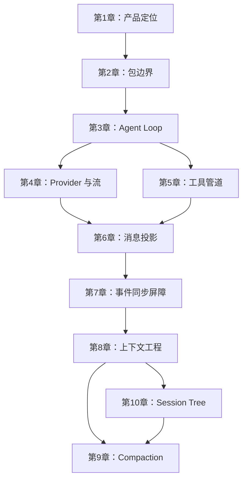
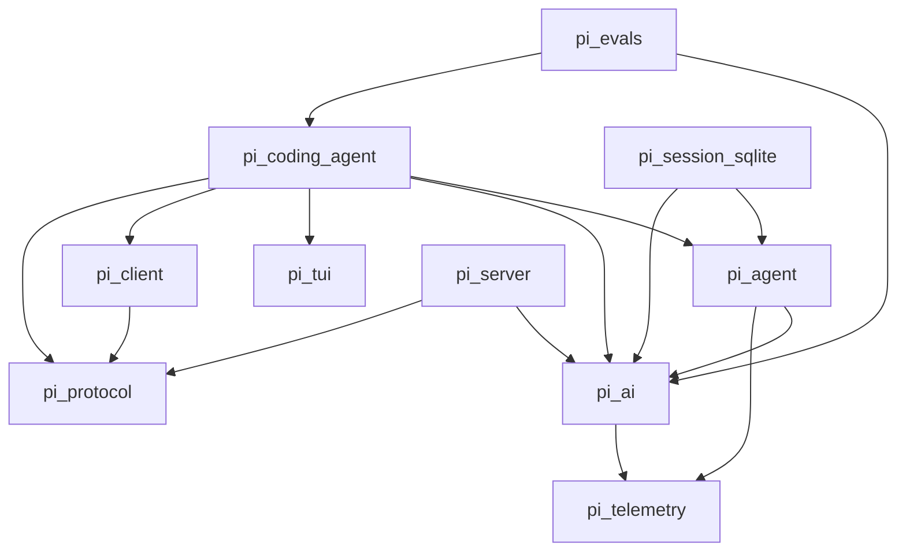
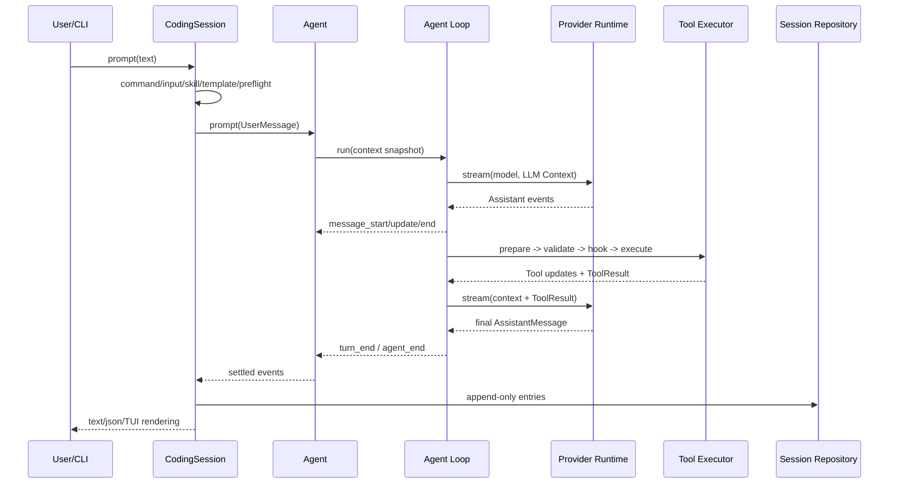
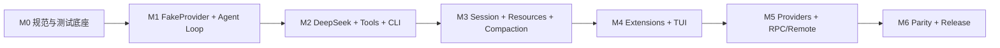

# Python Pi Agent 重写实施计划

> 目标仓库：`D:\pi-python`  
> 行为基线：`D:\pi`，Git `e14afc648e10fb6c527ea88fa627091ada764306`，核心 package 版本 `0.84.1`  
> 教程参考：[Pi Agent Book](https://dg-ai-notes.pages.dev/modules/)（基于 Pi `v0.80.2`）  
> 计划日期：2026-08-15  
> 当前阶段：只做架构和实施计划，不写实现代码

## 1. 结论先行

本项目不是把 TypeScript 逐行翻译成 Python，也不是把教程 `/python/` 页面中的示意代码拼起来。正确目标是：

1. 把 `D:\pi` 当前稳定运行路径当作**行为规范**。
2. 把教程当作**设计动机和知识递进说明**。
3. 用 Python 的类型、异步、测试和打包习惯重新实现同样的边界与行为。
4. 先完成一条可运行的纵向链路，再逐层扩大到完整产品，而不是同时铺开所有 package。
5. 最终覆盖当前源码中的稳定核心、CLI/TUI、扩展、资源、远程协议、遥测和评测；对源码中尚未完成的 `AgentHarness` 只在最后作为实验性架构处理，不伪装成已经存在的产品能力。

真实主链应始终保持为：

```text
CLI / TUI
  -> CodingSession（对应 AgentSession）
  -> Agent
  -> Agent Loop
  -> Provider Runtime
  -> DeepSeek / 其他模型
  -> Tool Call
  -> Tool Pipeline
  -> Tool Result
  -> 再次调用模型
  -> Session JSONL 持久化
  -> Event 消费者渲染或输出
```

第一条验收链路必须是：

```text
python -m pi_coding_agent -p "读取 pyproject.toml 并解释第一段配置"
  -> DeepSeek 返回 read tool call
  -> Python Agent 校验并执行 read
  -> ToolResult 写回上下文
  -> DeepSeek 给出最终回答
  -> 会话事件和消息顺序可以被测试
```

## 2. 事实来源与优先级

发生冲突时，按以下顺序判定：

1. `D:\pi` 当前提交的真实源码和当前活跃调用路径。
2. `D:\pi` 当前测试所固定的可观察行为。
3. `D:\pi\packages\coding-agent\docs` 中与当前源码一致的文档。
4. Pi Agent Book 对设计动机和概念的解释。
5. 教程的 Python 转写页，只作为语言映射示意。

教程明确基于 `v0.80.2`，本地源码是 `0.84.1`。因此不使用教程中的旧行号作为实现证据，也不假设教程没讲到的功能不存在。

### 2.1 必须冻结的源码基线

在开始写代码前，创建 `docs/baseline.md`，固定：

- Git commit：`e14afc648e10fb6c527ea88fa627091ada764306`。
- 当前稳定入口：`packages/coding-agent/src/cli.ts`。
- 当前产品会话：`packages/coding-agent/src/core/agent-session.ts`。
- 当前核心循环：`packages/agent/src/agent-loop.ts`。
- 当前持久化：`packages/coding-agent/src/core/session-manager.ts`。
- 当前 Provider 组合：`packages/coding-agent/src/core/model-runtime.ts` 与 `packages/ai`。
- 当前 DeepSeek 定义：`packages/ai/src/providers/deepseek.ts`。

后续若 `D:\pi` 更新，先做一次显式的 baseline diff，再决定是否迁移新行为，避免重写项目追着 `main` 无休止漂移。

### 2.2 当前稳定路径与未来 Harness 的边界

当前 `pi` CLI 使用：

```text
Agent -> AgentSession -> SessionManager
```

`packages/agent/src/harness/agent-harness.ts` 中的 `prompt`、`compact`、`resume`、`steer`、`followUp` 等仍有 `HarnessNotImplemented`。因此：

- 阶段 0–11 复刻成熟路径。
- Harness、operation records、lanes、SQLite durable backend 放在阶段 12。
- 阶段 12 只能称为“按上游接口意图实现实验能力”，不能声称它是当前 TypeScript CLI 的等价运行路径。

## 3. 教程全书分析与开发映射

教程当前正式发布 10 章。前六章是核心机制，后四章是工程化能力；教程提到的第 11–13 章尚未发布。

| 章节 | 文章核心 | 对 Python 重写的直接意义 | 实际开发位置 |
|---|---|---|---|
| [第1章：开篇](https://dg-ai-notes.pages.dev/modules/ch01-overview/) | Pi 是 Coding Agent、SDK 和教材；核心做减法，能力通过扩展增加 | 保持“库层”和“产品层”分离，不把 CLI、工具、Provider 塞进一个类 | 全局设计原则 |
| [第2章：三层架构](https://dg-ai-notes.pages.dev/modules/ch02-three-layer-arch/) | `pi-ai -> pi-agent-core -> pi-coding-agent`，TUI 正交 | 先确定 package 依赖和公共接口，再实现功能 | 阶段 0–1 |
| [第3章：Agent Loop](https://dg-ai-notes.pages.dev/modules/ch03-agent-loop/) | 内层工具循环、外层 follow-up 循环，steering 与 follow-up 语义不同 | FakeProvider 先固定循环、硬停止、队列和终止条件 | 阶段 1、3 |
| [第4章：模型调用](https://dg-ai-notes.pages.dev/modules/ch04-model-call/) | Provider 差异通过统一 Message 与 12 类流事件消化 | `Provider` 用 Protocol；先 Fake，再 OpenAI-compatible/DeepSeek | 阶段 1–2、11 |
| [第5章：工具系统](https://dg-ai-notes.pages.dev/modules/ch05-tools/) | Tool/AgentTool/ToolDefinition 三层，五步执行管道 | Pydantic 校验、hook、执行、结果规范化必须分层 | 阶段 3–4 |
| [第6章：消息系统](https://dg-ai-notes.pages.dev/modules/ch06-messages/) | AgentMessage 内部丰富，Provider Message 边界严格 | 两套消息类型，通过 `transform_context` 和 `convert_to_llm` 投影 | 阶段 1–3 |
| [第7章：事件驱动](https://dg-ai-notes.pages.dev/modules/ch07-event-driven/) | Agent/Turn/Message/Tool 四层生命周期；事件是异步同步屏障 | 先更新状态，再按顺序 await 监听器；UI 只消费事件 | 阶段 3、5、10 |
| [第8章：上下文工程](https://dg-ai-notes.pages.dev/modules/ch08-context-engineering/) | 工具截断、系统提示词、Compaction、Branch Summary 四道防线 | 截断先于压缩；资源加载与 Session 历史共同形成上下文 | 阶段 4、7–8 |
| [第9章：上下文压缩](https://dg-ai-notes.pages.dev/modules/ch09-compaction/) | 阈值、合法切点、turn prefix、结构化增量摘要 | 先实现 Session Tree，再把切点算法与 LLM 摘要器解耦 | 阶段 8 |
| [第10章：会话管理](https://dg-ai-notes.pages.dev/modules/ch10-session/) | append-only JSONL Session Tree、leaf、fork、上下文重建 | 不是 messages.json；必须保存状态 entry 和分支历史 | 阶段 6 |

### 3.1 全书的知识进程



教学顺序不等于开发顺序。开发时，Message、Event 和 FakeProvider 必须早于完整 Agent Loop；Session Tree 必须早于 Compaction。

### 3.2 教程没有覆盖但源码要求覆盖的内容

- Extension 生命周期、hook、命令、工具、Provider、快捷键和 UI 插槽。
- Skill 优先级、冲突、诊断和懒加载。
- Prompt Template 参数展开。
- Theme 与 TUI 差分渲染。
- Model Registry、模型配置覆盖、认证和 OAuth。
- project trust、资源热重载、Pi Package 安装与更新。
- print、JSON、RPC、interactive 四种模式。
- protocol/client/server、CBOR framing、远程 Session lease。
- telemetry、evals、SQLite session backend。
- 图片、附件、剪贴板、HTML/JSONL 导入导出。

这些内容必须直接以 `D:\pi` 为依据，不能等待教程的未来章节。

## 4. 目标 Python 架构

### 4.1 仓库形态

采用一个 Git monorepo 和一个 `uv` workspace，从一开始保留源码的逻辑 package 边界。各 package 在开发期可编辑安装，达到稳定后再决定是否分别发布 wheel。

```text
D:\pi-python
├─ pyproject.toml                 # workspace、统一工具配置
├─ uv.lock
├─ README.md
├─ docs/
│  ├─ baseline.md
│  ├─ architecture.md
│  ├─ parity-matrix.md
│  ├─ contracts/
│  │  ├─ messages.md
│  │  ├─ stream-events.md
│  │  ├─ agent-events.md
│  │  ├─ tools.md
│  │  └─ session-jsonl.md
│  └─ adr/
├─ packages/
│  ├─ telemetry/src/pi_telemetry/
│  ├─ ai/src/pi_ai/
│  ├─ agent/src/pi_agent/
│  ├─ coding_agent/src/pi_coding_agent/
│  ├─ tui/src/pi_tui/
│  ├─ protocol/src/pi_protocol/
│  ├─ client/src/pi_client/
│  ├─ server/src/pi_server/
│  ├─ session_sqlite/src/pi_session_sqlite/
│  └─ evals/src/pi_evals/
├─ tests/
│  ├─ contract/
│  ├─ integration/
│  ├─ e2e/
│  ├─ live_provider/
│  └─ parity/
└─ tasks/
   ├─ plan.md
   └─ todo.md
```

### 4.2 package 依赖图

箭头表示“左侧依赖右侧”。



硬性约束：

- `pi_ai` 不得 import Agent、Session、CLI 或本地文件工具。
- `pi_agent` 不得 import DeepSeek/OpenAI SDK 或 `pi_coding_agent`。
- `pi_tui` 不得 import 任何 AI/Agent package。
- `pi_coding_agent` 是 composition root，可以依赖下层并注入实现。
- UI 不拥有第二份 authoritative transcript；AgentState 与 Session 是事实源。

### 4.3 核心公共契约

先写契约和测试，再写实现。

```python
class StreamFn(Protocol):
    def __call__(
        self,
        model: Model,
        context: Context,
        options: StreamOptions,
    ) -> AssistantStream: ...

class AssistantStream(Protocol):
    def __aiter__(self) -> AsyncIterator[AssistantEvent]: ...
    async def result(self) -> AssistantMessage: ...

class AgentTool(Protocol[ParamsT, DetailsT]):
    spec: ToolSpec
    execution_mode: Literal["sequential", "parallel"]
    async def execute(
        self,
        call_id: str,
        params: ParamsT,
        cancel: CancellationToken,
        on_update: ToolUpdateSink[DetailsT] | None,
    ) -> AgentToolResult[DetailsT]: ...

class SessionRepository(Protocol):
    async def append(self, entry: SessionEntry) -> None: ...
    async def load(self, session_id: str) -> SessionRecord: ...
    async def fork(self, session_id: str, from_entry_id: str) -> SessionRecord: ...
```

契约设计原则：

- 外部 JSON、HTTP、环境变量、Extension、Session 文件边界用 Pydantic v2 校验。
- 内部稳定对象优先 `dataclass(slots=True, frozen=True)`。
- 判别联合使用 `Literal` discriminator 和 `match`。
- ID 使用 `NewType`，避免 tool call id、message id、entry id 混用。
- Provider/Tool/Storage 用 `Protocol`，不建立庞大的抽象基类。
- 公共事件和 Session JSON 必须有 `schema_version`，只做可追加的兼容演进。

### 4.4 错误语义

| 位置 | 预期失败的表达 | 不应吞掉的错误 |
|---|---|---|
| Provider | 终止 `error` 事件 + `AssistantMessage(stop_reason="error")` | 编程不变量、事件协议重复终止 |
| Tool | `ToolResultMessage(is_error=True)` | Agent 内部状态损坏、取消信号 |
| Session | 结构化 `SessionCorruptionError` | 中间损坏、重复 ID、未知父节点 |
| Extension | 产品层隔离并生成 diagnostic，按 hook 类型决定阻止或继续 | `CancelledError`、核心不变量 |
| CLI | stdout 保持协议纯净，诊断写 stderr，退出码表达失败 | API Key、token、认证内容不得进入输出 |

`asyncio.CancelledError` 必须继续传播，不能被普通 `except Exception` 误吞。

### 4.5 运行时序



## 5. 实施原则

### 5.1 Clean-room 重写规则

- 可以阅读源码来提炼行为和接口。
- 不复制实现函数，不做逐行语法替换，不照搬大段测试 fixture。
- 每个 Python 模块先写“行为契约 + 自己的测试”，再从零实现。
- 对复杂行为使用 FakeProvider 和自建 golden trace；必要时以 TypeScript 程序作为黑盒 oracle 比较输出。
- 每个可观察差异记录在 `docs/parity-matrix.md`，明确是未实现、刻意差异还是上游未完成。

### 5.2 纵向切片

不要按“先写完所有类型、再写完所有 Provider、最后连接”推进。第一个迭代就要贯穿三个核心 package：

```text
FakeProvider -> Agent Loop -> FakeTool -> ToolResult -> final answer -> print CLI
```

之后每个阶段都保留一条可运行的端到端路径。

### 5.3 测试默认离线

- 默认 `pytest` 清除所有 Provider API Key、用户配置、缓存和 Git 全局配置。
- 默认禁止网络。
- 所有 Agent/CodingSession 测试共享同一个 FakeProvider，不在各层重复 mock 私有函数。
- 真实 DeepSeek 只在显式 `live_provider` marker 下运行。
- 时间、UUID、临时目录在 golden trace 中规范化。

## 6. 分阶段实施计划

### 阶段 0：冻结规范与测试底座

**目标：** 建立不会随实现变化而漂移的行为规范、workspace 和验证工具。

**主要工作：**

- 创建 uv workspace、各逻辑 package 空壳和 import 依赖检查。
- 配置 pytest、pytest-asyncio、pytest-timeout、coverage、ruff、mypy。
- 建立 isolated home、fake clock、固定 UUID、禁止网络、清空凭据 fixture。
- 写五份契约文档：Message、Provider stream、Agent event、Tool、Session JSONL。
- 建立 `parity-matrix.md`，逐项映射“教程章节 -> TS 源码/测试 -> Python 模块/测试”。

**验收：**

- `uv sync --all-packages` 成功。
- `uv run pytest` 在零实现状态下运行基础设施自测，且不访问网络。
- import 依赖测试能发现反向依赖。
- baseline 明确排除未完成 Harness 作为当前主链。

**依赖：** 无。

### 阶段 1：可行走骨架（FakeProvider 纵向闭环）

**目标：** 在不访问真实模型的情况下跑通最小 Agent 闭环。

**主要工作：**

- 在 `pi_ai` 定义最小 Message、Content、Model、Context、ToolSpec、AssistantEvent。
- 实现 `AssistantStream` 与唯一共享的 `FakeProvider`。
- 在 `pi_agent` 实现最小串行 Agent Loop、FakeTool 和 ToolResult。
- 在 `pi_coding_agent` 实现内存 CodingSession 和 print CLI。
- 固化三条 golden trace：直接回答、一次工具、多轮工具。

**验收：**

- FakeProvider 能严格产生 start/delta/done 或 error 流。
- `user -> assistant(tool call) -> tool result -> assistant(final)` 顺序正确。
- `python -m pi_coding_agent -p` 在 FakeProvider 模式给出确定性答案。
- 所有测试重复运行三次，事件顺序相同。

**依赖：** 阶段 0。

### 阶段 2：`pi_ai` 完整基础与 DeepSeek

**目标：** 建立真实 Provider 边界，但不让 Provider 细节泄漏进 Agent。

**主要工作：**

- 补齐 text/thinking/image/tool-call content、usage、stop reason、thinking level。
- 实现 ProviderRegistry、ModelRegistry、CredentialResolver 和密钥脱敏。
- 实现 OpenAI-compatible 请求转换、SSE 解码、partial tool arguments 累积。
- 注册 DeepSeek `https://api.deepseek.com` 与 `DEEPSEEK_API_KEY`。
- 用 MockTransport 覆盖 400/401/429/500、断流、非法 SSE、context overflow。

**验收：**

- text、thinking、单/多 tool call、abort、error 的流事件完整且只终止一次。
- API Key 不出现在日志、异常、事件和 Session。
- 默认测试无网络；显式 live test 可调用 `deepseek-v4-flash`。
- 发布前可用 `deepseek-v4-pro` 做一次精确文本 smoke test。

**依赖：** 阶段 1。

### 阶段 3：完整 Agent Core 语义

**目标：** 对齐 `packages/agent/src/agent-loop.ts` 和 `agent.ts` 的稳定行为。

**主要工作：**

- 实现 AgentState、pending tool calls、streaming message、error state。
- 实现 Agent/Turn/Message/Tool 四层事件与 awaited listener barrier。
- 工具五步管道：prepare、validate、before hook、execute、after hook、result。
- 实现 sequential/parallel 批次；完成事件按完成顺序，持久化结果按模型原顺序。
- 实现 abort、late update 丢弃、length 截断不执行工具、terminate 语义。
- 实现 steering、follow-up、prepare-next-turn 和 stop-after-turn。

**验收：**

- 迁移 `agent-loop.test.ts` 中所有核心行为契约。
- streaming 期间第二次 prompt/continue 被拒绝且不污染 transcript。
- 异步监听器在 prompt 返回前全部完成。
- unknown tool、非法参数和工具异常均成为 error ToolResult。
- 核心协议和 Loop 达到至少 90% branch coverage。

**依赖：** 阶段 1；可与阶段 2 的 HTTP adapter 部分并行。

### 阶段 4：完整 Coding Tools 与执行环境

**目标：** 对齐 `read/bash/edit/write/grep/find/ls` 及输出截断、并发写保护。

**主要工作：**

- 先定义 FileOperations、ProcessOperations、SearchOperations Protocol。
- 实现 read/write/edit，并保留 BOM、CRLF 和原子 edit 语义。
- 实现 bash 的 cwd/env/timeout/abort/流式输出和进程树清理。
- 实现 grep/find/ls 的 `.gitignore`、隐藏文件、结果上限和 flag-like pattern。
- 实现 UTF-8 安全的 head/tail 截断、完整输出文件和明确截断提示。
- 实现按规范路径串行化的 file mutation queue。

**验收：**

- Windows 是必跑平台，Linux 作为第二矩阵。
- 超大单行、中文、emoji、BOM、CRLF、符号链接和二进制文件都有测试。
- edit 出现重叠、缺失、重复目标时整体失败，不产生部分修改。
- abort/timeout 后没有后台进程和迟到输出。

**依赖：** 阶段 3。

### 阶段 5：CodingSession 与无头 CLI MVP

**目标：** 形成可日常测试的产品层组合根，对应成熟 `AgentSession` 路径。

**主要工作：**

- 实现 CodingSession、Service 容器和 composition root。
- 实现模型选择、thinking、工具 allow/exclude、auth preflight。
- 实现 print text、JSON events、stdin prompt、无 Session 模式。
- 实现 stderr diagnostics、退出码、Ctrl+C 中止和 stdout 洁净。
- 连接 DeepSeek、read 工具和真实工作目录。

**验收：**

- `--help`、`--version`、`--list-models` 返回 0。
- text 模式 stdout 只有最终文本；JSON 模式每行都是合法 JSON。
- assistant error 返回非零退出码，stderr 不泄漏密钥。
- 完成真实的 DeepSeek + read tool-loop。

**依赖：** 阶段 2–4。

### Checkpoint A：核心 MVP

- FakeProvider 契约稳定。
- DeepSeek 文本、流式和工具调用可用。
- 七个工具可在临时 workspace 中工作。
- CLI 可在 `D:\pi-python` 外安装并执行。
- 只有通过该检查点后才进入持久化和高级产品能力。

### 阶段 6：Append-only JSONL Session Tree

**目标：** 对齐成熟 `SessionManager` 的恢复、分支和上下文重建语义。

**主要工作：**

- 定义 Header 和 message/model/thinking/custom/compaction/branch/label/session-info entry。
- 实现 InMemory 与 JSONL Repository，并运行同一套 conformance tests。
- 实现 id/parent_id/leaf、append、open、resume、continue-recent、fork、tree navigation。
- 实现 `build_session_context()`，只投影当前 leaf 路径。
- 实现 torn-tail 修复、中间损坏拒绝、staging + atomic rename。
- 在工具执行和恢复之间建立幂等边界，禁止重新执行已有副作用。

**验收：**

- 重启后得到相同消息、模型、thinking 和 active branch。
- abandoned branch 不进入 LLM Context，但数据仍保留。
- 已有 ToolResult 的 ToolCall 恢复后不再次执行。
- 文件尾部半行可修复；中间损坏和 schema 非法必须失败。

**依赖：** 阶段 5。

### 阶段 7：Settings、Prompt、Resources、Trust、Skills

**目标：** 构成 Coding Agent 的项目上下文和可配置资源层。

**主要工作：**

- 实现 global/project settings 合并和 schema 校验。
- 实现 system prompt builder、日期/cwd、active tools 描述。
- 从根到 cwd 发现并有序合并 AGENTS.md/CLAUDE.md。
- 实现 Prompt Template 参数展开。
- 实现 user/project Skills 的 frontmatter、优先级、冲突、懒加载和显式调用。
- 实现 ResourceLoader、diagnostics、reload 和 project trust。

**验收：**

- 未信任项目不能加载项目级可执行 Extension。
- 坏资源产生 diagnostic，不使整个 Agent 崩溃。
- Skill 正文默认不全部进入上下文；模型只看到索引。
- tools/skills/context 变化后 system prompt 可重建。

**依赖：** 阶段 5；Session 相关资源事件依赖阶段 6。

### 阶段 8：可靠性、Compaction 与分支摘要

**目标：** 对齐教程第 8–10 章以及 `AgentSession` 的产品可靠性行为。

**主要工作：**

- 完整实现 steering/follow-up queue mode 与 agent_settled。
- 实现可取消 retry 分类和 backoff。
- 实现 token/context usage 估算及 overflow 识别。
- 实现合法切点、recent tail、turn prefix、结构化增量摘要。
- 实现 manual、threshold、overflow compact-and-retry。
- 实现 LCA branch summary、文件操作跟踪和 Session tree navigation。

**验收：**

- Compaction 纯算法使用 FakeSummarizer 完全离线测试。
- Context 为最新 summary + retained tail，tool call/result 不被非法拆开。
- overflow 自动压缩并重试最多一次。
- retry、compact、listener 全部结束后才发 agent_settled。

**依赖：** 阶段 6–7。

### Checkpoint B：日常可用 Coding Agent

- 可在真实项目中安全完成读取、修改、命令和多轮工具任务。
- Session 可 resume/fork/tree navigation。
- 长上下文能自动压缩并继续任务。
- Settings、AGENTS、Skills、Templates、project trust 可用。

### 阶段 9：Extension 与 Pi Package 生态

**目标：** 复刻“极简核心 + 可扩展外壳”的产品哲学。

**主要工作：**

- 定义 ExtensionContext/ExtensionAPI 和稳定 hook 输入输出。
- 按源码时序实现 input/context/before-agent/provider/tool/session hooks。
- 支持注册 Tool、Command、Provider、Flag、Shortcut 和自定义 Session entry。
- 实现 Python entry point、本地模块、project extension 的发现与 trust。
- 实现异常隔离、取消、reload、stale context 失效和 shutdown。
- 实现 package manifest、资源安装、启用/禁用和更新的最小闭环。

**验收：**

- Extension command 不消耗 Provider response。
- tool_call 可以阻止或改写，tool_result 可以后处理。
- 第三方 Extension 崩溃产生 diagnostic，不破坏核心 Session 文件。
- reload 后旧 ExtensionContext 不再可用。

**依赖：** 阶段 7–8。

### 阶段 10：`pi_tui` 与完整交互模式

**目标：** 保持 TUI 正交，通过事件订阅实现日常交互体验。

**主要工作：**

- 定义 Terminal Protocol 和 VirtualTerminal。
- 实现 Unicode/ANSI 宽度、布局、差分渲染、resize 和滚动。
- 实现 editor、history、undo、autocomplete、paste、快捷键。
- 渲染 text/thinking/tool progress/error/usage/context/cost。
- 实现 model/settings/session/tree/compact/select overlays。
- 实现 `/model`、`/new`、`/resume`、`/tree`、`/compact`、`/settings` 等命令。
- 后续再加入 Kitty/iTerm2 图片协议，不阻塞文本 TUI 发布。

**验收：**

- VirtualTerminal 在 80x24、40x10、resize 下无残影。
- CJK、emoji、ANSI 样式和宽字符不越界。
- Escape 能中止，Ctrl+C/粘贴/history/overlay focus 行为明确。
- Windows ConPTY 完成真实交互 smoke test。

**依赖：** 阶段 5–9；`pi_tui` 自身不得反向依赖这些 package。

### 阶段 11：Provider 广度、认证与模型目录

**目标：** 在核心已稳定后扩展到当前 `pi_ai` 的协议和认证广度。

**主要工作：**

- 建立所有 adapter 共享的 Provider contract suite。
- 按协议族实现 OpenAI Responses/Completions、Anthropic Messages、Google、Bedrock。
- 再挂接使用这些协议的具体 Provider，而不是每家复制一套 Loop。
- 实现 API Key、OAuth、credential refresh、模型覆盖和动态 catalog。
- 实现 thinking、cache、usage/cost、tool id、cross-provider handoff 兼容层。

**验收：**

- 新 Provider 只新增 adapter/config，不修改 Agent Loop。
- Credential 可报告状态但不能暴露 secret。
- 动态模型刷新失败可回退缓存，取消不会挂起启动。
- 每个协议族至少有一个显式 live smoke test，默认测试仍无网络。

**依赖：** 阶段 2、5、9。

### 阶段 12：JSON/RPC、Protocol、Client、Server 与实验 Harness

**目标：** 覆盖当前 monorepo 的远程和可嵌入运行面。

**主要工作：**

- 完整实现 stdin/stdout JSON RPC，保证 stdout framing 纯净。
- 实现 `pi_protocol` 的 schema、CBOR、4 字节大端 framing 和大小限制。
- 实现 `pi_client` 的连接、请求、event、lease、重连和 disposal。
- 实现 `pi_server` 的连接、多 Session 生命周期和 transport。
- 实现 SQLite Session backend conformance。
- 最后按上游未完成接口探索 operation records、lanes 和 AgentHarness。

**验收：**

- protocol/client/server 分别有独立 contract 和 conformance tests。
- 网络断开、重连、重复请求和租约丢失不会重复执行工具。
- RPC stdout 不混入日志。
- Harness 在完成前明确标为 experimental，不替换成熟 CodingSession。

**依赖：** 阶段 6、8、11。

### 阶段 13：产品外围能力

**目标：** 补齐稳定产品体验，但不改变 Agent 核心语义。

**主要工作：**

- Session HTML/JSONL 导出、导入、分享。
- 图片附件、剪贴板、终端图片渲染和文件引用。
- Package manager 来源解析、安装、升级、禁用和诊断。
- theme、keybindings、shell completion、first-run 和自更新。
- 跨平台路径、PowerShell/cmd/bash quoting 和安装器。

**验收：**

- 所有外围功能通过公共 Session/Event API 工作，不读取私有 Agent 状态。
- 导入导出 round-trip 不丢消息和 Session entry。
- package/project 资源始终经过 trust。
- Windows 与 Linux 安装 smoke test 通过。

**依赖：** 阶段 9–12。

### 阶段 14：Telemetry、Evals、差分验证与发布

**目标：** 证明 Python 实现不仅“看起来像”，而且具备可维护的行为证据。

**主要工作：**

- 实现 no-op/in-memory/real telemetry Protocol 与 span/event。
- 建立 eval harness、FakeProvider 回归集和真实模型小型评测。
- 建立 TypeScript oracle 与 Python 输出的差分测试。
- 从仓库外安装 wheel，在全新 HOME 中运行 help/version/models/print/interactive。
- 完成用户文档、SDK 文档、Extension 文档、迁移与兼容说明。

**验收：**

- 所有 package unit/contract/integration/e2e 通过。
- 核心 Loop、Session、Provider、Tools 无未解释 parity 差异。
- release wheel 不依赖源码目录。
- DeepSeek 默认模型完成最后一次低 token smoke test。
- 人工审查并批准后才标记 1.0。

**依赖：** 所有前序阶段。

### Checkpoint C：完整稳定产品

- 扩展、TUI、多 Provider、认证、资源包、RPC/远程能力可用。
- 实验 Harness 与稳定 CLI 路径边界清楚。
- 差分测试和 release smoke test 提供可重复证据。

## 7. 功能覆盖矩阵

| 源码能力 | Python 目标 | 阶段 | 首次发布是否阻断 |
|---|---|---:|---|
| pi-ai Message/Model/Context/Tool | 完整 | 1–2 | 是 |
| Provider stream 与 FakeProvider | 完整 | 1–2 | 是 |
| DeepSeek | 完整 | 2 | 是 |
| Agent Loop/State/Event | 完整 | 3 | 是 |
| read/bash/edit/write | 完整 | 4 | 是 |
| grep/find/ls | 完整 | 4 | 日常版阻断 |
| CodingSession + print/json | 完整 | 5 | 是 |
| JSONL Session Tree | 完整 | 6 | 日常版阻断 |
| Settings/Prompt/AGENTS/Skills/Templates | 完整 | 7 | 日常版阻断 |
| retry/compaction/branch summary | 完整 | 8 | 日常版阻断 |
| Extension/Pi Package | 完整 | 9 | 完整版阻断 |
| pi-tui/interactive | 完整 | 10 | 完整版阻断 |
| Provider zoo/OAuth/catalog | 按协议族逐步完整 | 11 | 1.0 阻断 |
| JSON/RPC | 完整 | 12 | 1.0 阻断 |
| protocol/client/server | 完整稳定部分 | 12 | 可独立发布 |
| SQLite/new Harness | experimental | 12 | 不阻断稳定 CLI |
| export/image/clipboard/theme/update | 完整 | 13 | 1.0 前审查 |
| telemetry/evals/release | 完整 | 14 | 1.0 阻断 |
| 向量数据库“长期记忆” | 不实现，源码无对应核心 | — | 否 |
| 默认 MCP/子 Agent/计划模式 | 不内建；通过 Extension 实现 | 9 后 | 否 |

## 8. 测试与验证策略

### 8.1 测试层次

| marker | 用途 | 默认运行 |
|---|---|---|
| `unit` | 纯函数、codec、reducer、cut point | 是 |
| `contract` | Provider/Tool/Session backend 公共契约 | 是 |
| `integration` | package 组合、mock HTTP、临时文件系统 | 是 |
| `cli` | 黑盒子进程、stdout/stderr/exit code | 是 |
| `tui` | VirtualTerminal、ANSI/CJK/resize | CI 专项 |
| `parity` | TypeScript oracle 对比 | CI 专项 |
| `live_provider` | DeepSeek/其他真实 API | 否，显式运行 |

### 8.2 核心契约测试

必须固定以下行为：

- `transform_context` 先于 `convert_to_llm`。
- stream terminal event 恰好一次。
- `length` 截断的 tool call 不执行。
- sequential 工具强制整批串行。
- parallel 的 `tool_execution_end` 按完成顺序，ToolResult 按源顺序。
- steering 在工具批次完成后注入，follow-up 在 Agent 原本结束后注入。
- abort 后迟到 delta/update 丢弃。
- Session 恢复不重复执行副作用。
- JSONL 只修复 torn tail，不静默吞掉中间损坏。
- JSON/RPC stdout 永远只有协议帧。

### 8.3 标准验证命令

```powershell
uv sync --all-packages
uv run ruff format --check .
uv run ruff check .
uv run mypy packages
uv run pytest -m "not live_provider"
uv run pytest -m contract
uv run pytest -m cli
uv run pytest -m tui
```

真实 DeepSeek 只显式运行：

```powershell
uv run pytest -m live_provider --provider deepseek --model deepseek-v4-flash
```

## 9. 每个任务的 Definition of Done

每个任务只有同时满足以下条件才算完成：

- 任务自己的验收条件全部满足。
- 新行为有测试，且该测试在没有实现时会失败。
- 相关 contract/integration 测试通过。
- ruff format、ruff check、mypy 通过。
- 真实运行验证完成，而不只是类型检查。
- 没有 API Key、token、用户目录或临时路径泄漏进日志和 fixture。
- 没有无关重构、调试输出、死代码和被注释掉的实现。
- 公共接口和行为同步更新文档/ADR/parity matrix。
- 取消、安全、跨平台和错误路径已经审查。
- 高风险变更有回滚路径并经人工审查。

## 10. 主要风险与控制措施

| 风险 | 影响 | 控制措施 |
|---|---|---|
| 教程 v0.80.2 与源码 v0.84.1 漂移 | 实现旧行为 | 固定 commit，以源码和测试优先 |
| 把未完成 Harness 当主链 | 架构从根上错误 | 阶段 0 明确排除，阶段 12 单独实验 |
| “OpenAI-compatible” 细节不一致 | tool/thinking/stop reason 错乱 | adapter contract + mock SSE + live smoke |
| 并行完成顺序与持久化顺序混淆 | 下一轮 Context 非确定 | 两套顺序分别测试 |
| retry/resume 重复执行写文件或 shell | 严重副作用 | ToolCall/ToolResult 持久化幂等边界 |
| 事件监听器和迟到 update 竞态 | Session/TUI 状态污染 | awaited barrier、settled guard、取消测试 |
| JSONL 损坏处理过宽 | 静默丢失历史 | 仅 torn tail 可修复，中间损坏硬失败 |
| Windows 进程/路径/CRLF/ConPTY | 本机不可用 | Windows 主矩阵，Linux 次矩阵 |
| TUI 使用 `len()` 计算宽度 | CJK/emoji 残影 | wcwidth/VirtualTerminal/真实 ConPTY |
| Extension 执行不受 trust 约束 | 任意代码风险 | user/project scope、trust、诊断和隔离 |
| 一开始追求所有 Provider/TUI | 核心长期不可用 | Checkpoint A/B/C，逐层扩展 |
| Clean-room 退化成逐行翻译 | 难维护且违背目标 | contract-first、独立命名、行为差分 |

## 11. 里程碑



- **M0**：规范冻结，workspace 和离线测试可运行。
- **M1**：FakeProvider 驱动的所有 Agent Loop 契约通过。
- **M2**：DeepSeek + 七工具 + headless CLI 可完成真实任务。
- **M3**：resume、branch、compaction、Skills、Prompt、Trust 可用。
- **M4**：Extension 和交互 TUI 达到日常使用水平。
- **M5**：多 Provider、OAuth、RPC、client/server、SQLite/实验 Harness。
- **M6**：差分验证、完整文档和仓库外安装发布。

## 12. 开始实现前的决策门

建议默认采用以下决定；只有你明确要求不同方向时才更改：

1. **兼容目标**：先实现语义兼容，不承诺 Python JSONL 与 TypeScript 文件逐字节互读；阶段 6 再增加导入器。
2. **初始 Provider**：FakeProvider + DeepSeek，其他 Provider 后移。
3. **初始 UI**：print/json，完整 TUI 后移，但 `pi_tui` package 边界从一开始保留。
4. **存储**：成熟 CodingSession 的 JSONL Session Tree 优先；新 Harness/SQLite 最后。
5. **Memory**：不添加向量数据库，因为当前源码没有独立语义记忆核心。
6. **扩展策略**：核心只提供稳定 hook；MCP、子 Agent、计划模式作为扩展示例，而非默认内建。
7. **源码保护**：`D:\pi` 全程只读；所有 Python 代码只写入 `D:\pi-python`。

实施时从 `tasks/todo.md` 的 P0-T01 开始，每完成一个小任务就运行其 focused test；每个阶段通过检查点后再进入下一阶段。
