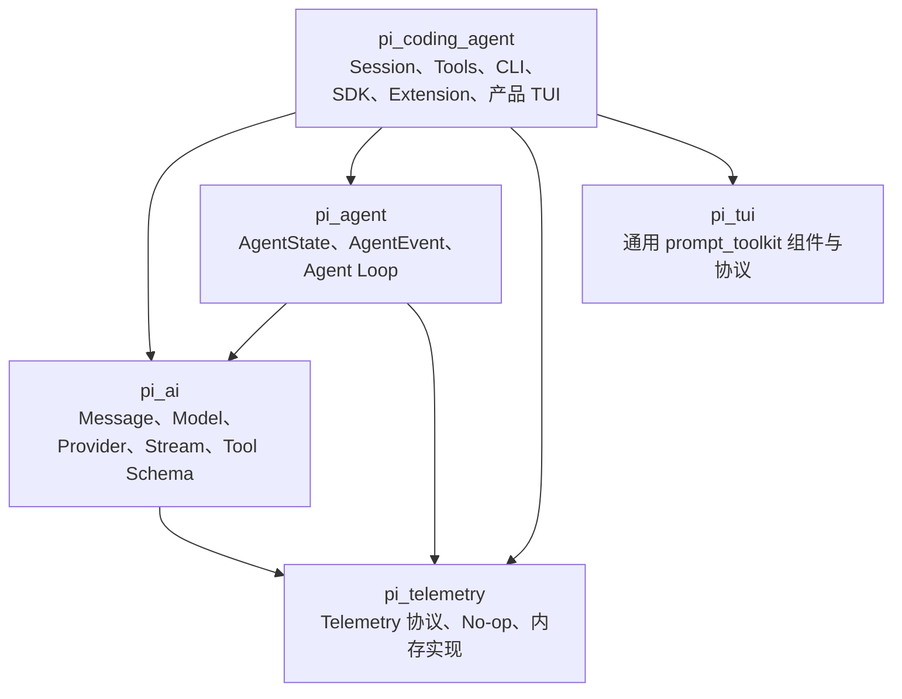
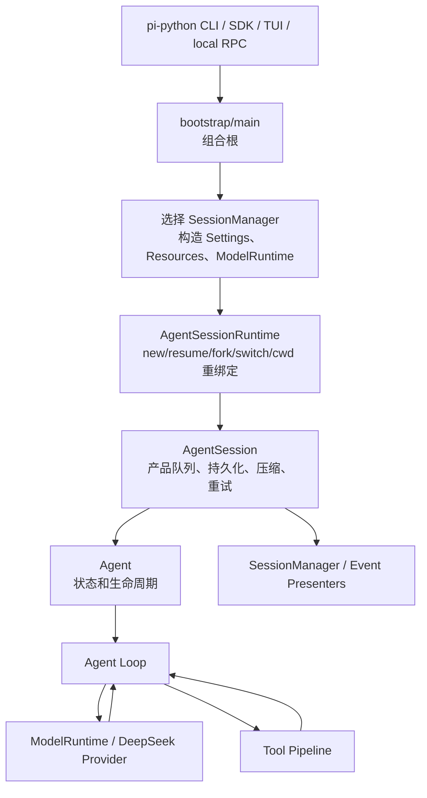

# Pi Agent Python 重写实施计划

> 状态：已冻结，Phase 0 正在实施
> 上游源码：`D:\pi`
> 冻结提交：`e14afc648e10fb6c527ea88fa627091ada764306`
> 上游版本：`0.84.1`
> Python：`>=3.12`
> 本文是项目范围和阶段验收的事实来源；原子执行任务见 [todo.md](todo.md)。

## 1. 权威顺序与目标

当资料冲突时，固定采用以下顺序：

1. `D:\pi` 冻结提交中的当前源码与测试。
2. 冻结提交 `e14afc648e10fb6c527ea88fa627091ada764306` 和版本 `0.84.1`。
3. Pi Agent 教程仅解释设计动机。教程基于较早的 `v0.80.2`，其中 Python 页面不是可执行规范。
4. Python 依赖与外部协议采用实施时核验的官方文档，并以 ADR 记录会改变行为的更新。

目标是在不复制上游 TypeScript 实现的前提下，以 Python 重新实现相同的关键产品行为、数据契约和模块边界。源码证据决定兼容行为；Python 惯用设计决定内部写法。

## 2. 已纠正的架构事实

- `AgentSession` 持有 `Agent`；`AgentSessionRuntime` 管理 new/resume/fork/switch 以及 cwd-bound 服务重建。
- `main/bootstrap` 是真正的组合根，SDK factory 复用同一组合路径。
- 成熟的同步 v3 `SessionManager` 与实验性 Harness、lanes、SQLite、远程协议相互独立；实验性部分不进入 1.0。
- Provider 单请求重试与 `AgentSession` 整轮重试是两个可观测、独立计数的层级。
- v3 Session 只在 Header 中使用 `version: 3`；Event 和普通 Entry 不增加 `schema_version`。
- `read` 截断后只保留头部并提示 offset；仅 Shell 输出累积器保存截断前的完整输出。
- 通用 TUI 不依赖 Agent/AI；Agent-aware renderer 位于 `pi_coding_agent`。
- 1.0 不承诺崩溃后恰好一次副作用。恢复未配对 Tool Call 时只追加一次错误结果，绝不重放工具。

## 3. Python 包边界

一个 distribution、一个根 `pyproject.toml`、一个 `uv.lock`：

```text
src/
├── pi_telemetry/
├── pi_ai/
├── pi_agent/
├── pi_tui/
└── pi_coding_agent/
```



硬性依赖规则：

- `pi_telemetry` 不导入其他项目包。
- `pi_ai` 只可导入 `pi_telemetry`。
- `pi_agent` 只可导入 `pi_ai`、`pi_telemetry`。
- `pi_tui` 不导入任何其他 `pi_*` 包（包括 `pi_telemetry`）；产品 telemetry 只在组合根 `pi_coding_agent` 接入。
- `pi_coding_agent` 是产品组合层，可以导入其余四个包。

## 4. 运行链路与所有权



一次请求的数据流：

```text
用户输入
→ AgentMessage
→ transform_context
→ convert_to_llm
→ pi_ai.Message / Context
→ DeepSeek 流
→ AssistantMessageEvent
→ AssistantMessage
→ ToolCall
→ prepare_arguments
→ Pydantic 参数校验
→ before_tool_call
→ execute
→ after_tool_call
→ ToolResultMessage
→ 追加到 Agent Context
→ 再次调用模型
→ 最终 AssistantMessage
```

## 5. 公共契约原则

### 5.1 类型

- 内部公共领域对象：带 `Literal` 判别字段的 dataclass。
- JSON、RPC、配置、Session 和工具参数边界：Pydantic v2。
- wire 输出使用 alias 保持 TypeScript 兼容 camelCase；Python API 使用 snake_case。
- Provider、Tool Operations、CredentialResolver、ResourceLoader、UI bridge 使用 `Protocol`。
- Provider 和 Agent Event 流使用 `AsyncIterator`。
- 成熟 SessionManager 保持同步；产品层用 `asyncio.to_thread()` 包装耗时整文件操作。

### 5.2 主要接口

- `pi_ai`：Message、Context、Model、Tool、AssistantMessageEvent、AssistantStream、Provider、CredentialResolver、FakeProvider。
- `pi_agent`：AgentMessage、AgentState、AgentEvent、AgentTool、Agent、`run_agent_loop()`。
- `pi_coding_agent`：SessionManager、AgentSession、AgentSessionRuntime、ModelRuntime、`create_agent_session()`、同步 SDK、Extension API。
- `pi_tui`：Component、Dialog、Overlay、Editor、Theme、Terminal Adapter 协议及 prompt_toolkit 实现。
- `pi_telemetry`：TelemetryContext、NoopTelemetry、InMemoryTelemetry。

### 5.3 错误

- 预期 Provider 网络/API 错误转换为终止 `error` 流事件。
- 取消转换为 `aborted`，不自动重试。
- 未知工具、参数非法、工具执行失败转换为 `ToolResultMessage(is_error=True)`。
- Session 损坏、配置非法、扩展加载失败使用明确 typed exception。
- 框架不变量或编程错误不伪装为 ToolResult，测试中直接失败。
- CLI 参数错误退出 `2`；配置/Provider/Session 运行错误为 `1`；成功为 `0`；用户中断为 `130`。
- text/JSON/RPC 输出不得含 traceback、Authorization header 或密钥。

详细 wire 契约、错误语义和兼容表位于 `docs/contracts/` 与 `docs/compatibility/`。

## 6. Python 1.0 范围

### 6.1 必须支持

- DeepSeek V4 Flash/Pro 流式 text、thinking、tool call、usage，默认 Pro。
- FakeProvider 和完整 Agent Loop。
- `read/write/edit/bash/grep/find/ls`。
- Windows/Linux 默认 Bash；PowerShell 作为随包提供且默认关闭的 Python Extension。
- 同步 v3 Session JSONL、树、fork、resume、import/export、compaction、branch summary。
- CLI text/JSON/交互模式及本地 stdin/stdout JSONL RPC。
- 异步 SDK 与同步便利封装。
- Settings、Prompt、Skill、Theme、上下文文件和项目资源信任。
- Python-native Extension 的工具、命令、flags、快捷键、Provider、认证交互、hooks、renderers、session actions 和 UI。
- local/Git/PyPI Python 包，以及 npm Pi Package 中的纯数据资源。
- prompt_toolkit TUI 的功能和动作语义对齐。
- HTML export、文本剪贴板、文件/图片附件数据契约。
- 默认关闭的逐工具权限 Extension。
- GitHub Release wheel/sdist、SHA-256 清单与构建证明。

### 6.2 明确差异

- 命令名是 `pi-python`，不覆盖上游 `pi`。
- 全局配置 `~/.pi-python/agent`，项目配置 `.pi-python/`。
- `.pi/` 只在显式兼容模式下只读挂载或选择性导入。
- 内建 Provider 只有 DeepSeek；其他 Provider 由 Extension 注册。
- 内核不保存凭据；DeepSeek 使用 CLI/env/.env，Extension 自行实现认证持久化。
- 不执行 JS/TS Extension。
- TUI 不追求上游自研渲染器的逐像素一致。
- DeepSeek 不支持图片时在请求前明确拒绝；不实现 Kitty/iTerm2 图片协议。
- macOS 明确不支持。
- 损坏 v3 文件采用比 TypeScript 更严格的拒绝策略。
- 默认与 Pi 一样没有核心 sandbox；权限门是默认关闭的可选扩展。
- Python 原创代码暂不授权；上游材料的 MIT 声明放在 `THIRD_PARTY_NOTICES.md`。

### 6.3 Post-1.0

- Harness、operation records、lanes、v4 repository。
- SQLite Session 后端。
- 实验性 protocol/client/server 与远程 Session。
- 内建多 Provider、内建 OAuth、凭据仓库。
- Node sidecar/TS Extension 执行。
- 终端图片协议与 macOS 支持。

## 7. 阶段路线图

每个 Phase 使用短分支 `phase/NN-name`；每个任务一个可观察行为和一个提交。Phase 完成后创建 PR，并在用户验收前停止。Phase 0 的 main bootstrap 是唯一允许直接推 main 的例外。

### Phase 0：规范、审查基线和测试底座

实现：

- 归档旧 plan/todo，替换为本计划和可执行原子任务表。
- 建立 surface matrix；每项只允许 Supported、Intentional divergence、Post-v1。
- 冻结 Message/Event/Tool/Session v3/错误/路径/命名/兼容契约。
- 建立 threat model。
- 初始化单 wheel、Hatchling、uv、Ruff、Pyright strict、pytest 和 CI。
- 提供 FakeClock、FakeProvider、FakeTool、isolated home、临时 workspace、网络禁用 fixture。
- 提供只读 TypeScript oracle；不得对 `D:\pi` 运行修改型检查。
- `.env.example`、`.gitignore`、本地与 CI secret scan。
- `THIRD_PARTY_NOTICES.md` 写明上游 MIT 与冻结 commit；不创建根 LICENSE。

验收：冻结同步、lint、format、type、offline test、build 和 secret scan 全部通过。首次推送 main 后启用 required checks 与禁止直接推送。停止并等待用户验收。

### Phase 1：`pi_telemetry` 与 `pi_ai` 基础原子

先以独立依赖任务把 Pydantic v2 写入 `pyproject.toml` 与 `uv.lock`，再实现 No-op/InMemory telemetry；Message/content/image/tool/context/model/usage/thinking 类型；12 类 Assistant 流事件；Provider、AssistantStream、FakeProvider；codec/schema；CredentialResolver 协议。

验收：wire round-trip；text/thinking/tool/multiple/error/abort 顺序；schema 成败矩阵；完全离线和确定性。

### Phase 2：`pi_agent` 与核心循环

实现 AgentMessage 与 LLM Message 分层、内部消息、`transform_context()` 后 `convert_to_llm()`、AgentState/Event/Tool/Agent、五步工具流水线、顺序/并行调度、steering/follow-up 双队列、监听/取消/并发防护。

验收：无工具到多轮链路；错误矩阵；abort/length/terminate/max rounds；队列顺序；`wait_for_idle()` 等待 Agent 与异步 listener。

### Phase 3：稳定产品契约与 v3 Session 基础

实现完整 v3 Header 与当前 Entry；extra/custom 保留，未知 type 拒绝；同步 SessionManager；append-only tree/leaf/branch/fork/delayed creation；纯读 open/list/export；原子整文件写；严格损坏检测；提供只读来源、写入新 `.pi-python` 文件的成熟 v3 `import-pi-session` 服务；冻结 Settings/Resource/Extension/UI/SessionImporter Protocol 与 no-op 实现。

验收：TypeScript/Python 合法 v3 双向兼容；追加不改旧行；导入不改来源字节；状态恢复；损坏失败且文件字节不变；独立 checkpoint 任务更新 `pyproject.toml`、`uv.lock`、`CHANGELOG.md`，从仓库外安装 wheel 并 smoke；用户确认后才 tag/release `0.1.0`。

### Phase 4：DeepSeek Provider

先以独立依赖任务把固定版本 `openai`（`AsyncOpenAI`）写入 `pyproject.toml` 与 `uv.lock`，再实现 `max_retries=0`、仅流式 chat completions、Flash/Pro 目录、thinking/tool partial JSON/usage/stop、凭据优先级、仅在尚无语义 delta 时的有限请求重试、300 秒 idle timeout。

验收：Mock SSE 覆盖正常、429、5xx、timeout、partial JSON；默认无 Key/无网络；live smoke 另行获得批准。

### Phase 5：Coding Tools

实现 Operations Protocol 与七个工具；Windows Bash 发现；read/shell 各自截断语义；edit 原子匹配；BOM/换行保留；canonical path mutation queue；系统优先 rg/fd 与受校验下载；保持上游宽权限默认值。

验收：Unicode/长行/BOM/CRLF/symlink；shell exit/timeout/abort/process tree；无迟到污染；批次顺序稳定。

### Phase 6：可运行的无头产品切片

实现 bootstrap/main、AgentSessionRuntime、AgentSession、ModelRuntime/provider factory、异步/同步 SDK、首版 CLI，以及恢复未配对 Tool Call 的一次性错误结果策略。

验收：仓库外 wheel 可运行；FakeProvider CLI 黑盒；`import-pi-session` CLI/SDK 黑盒；经批准的 DeepSeek smoke；独立 checkpoint 任务更新版本与 changelog、仓库外 wheel smoke，用户确认后才 tag/release `0.2.0`。

### Phase 7：Settings、Prompt、Skill、Theme 与 Resource Discovery

实现全局/项目目录、环境变量兼容、资源优先级、只读 `.pi` adapter、选择性导入、project trust、context/system prompt/templates/skills/theme descriptors。此阶段不执行 Extension。

验收：优先级矩阵；未信任无代码执行/安装；兼容源只读；Skill/XML/懒加载；上下文顺序确定。

### Phase 8：AgentSession 高级行为

实现产品 Event 分层、整轮 retry、retry 状态与取消、overflow 分离、manual/auto compaction、增量摘要、branch summary/LCA/文件跟踪、model/thinking 恢复和 tree view。

验收：retry 成功/耗尽/取消/工具后重试；总尝试精确；切点不在 ToolResult 中间；overflow 最多恢复一次；fixture 对齐；独立 checkpoint 任务更新版本与 changelog、仓库外 wheel smoke，用户确认后才 tag/release `0.3.0`。

### Phase 9：通用 `pi_tui`

先以独立依赖任务把固定版本 `prompt_toolkit` 写入 `pyproject.toml` 与 `uv.lock`，再实现 Terminal Adapter、通用组件、regular/fullscreen、resize/history/undo/paste/autocomplete、CJK/emoji/ANSI 宽度、动作和替代键、MemoryTerminal/pipe input。

验收：多尺寸/resize；stream 无残影；输入焦点行为；Windows/Linux CI；依赖边界仍成立。

### Phase 10：Extension 与 Pi Package

实现 trust 后 import、统一 await hooks、完整注册面、扩展自有认证持久化、local/Git/PyPI 包、托管环境/锁文件、npm `pack --ignore-scripts` 数据资源、DefaultResourceLoader、hot reload/teardown/lifecycle，以及默认关闭的 permission-gate 与 PowerShell 扩展。

验收：未信任不 import；第三方异常隔离；包锁定/update/offline/hash；npm scripts 禁止；dynamic flags 两阶段解析；独立 checkpoint 任务更新版本与 changelog、仓库外 wheel smoke，用户确认后才 tag/release `0.4.0`。

### Phase 11：交互式 Coding Agent TUI

实现 Agent-aware renderers、Session selector/tree/fork、model/thinking/settings selector、slash/Skill/Prompt/Extension UI、regular/fullscreen、剪贴板、附件契约与图片 capability error。

验收：完整 FakeProvider 交互；stream/tool/compaction/switch/dialog；中文/CJK/emoji；Windows 真终端 smoke；独立 checkpoint 任务更新版本与 changelog、仓库外 wheel smoke，用户确认后才 tag/release `0.5.0`。

### Phase 12：完整稳定产品面

关闭所有 1.0 Supported surface；完整 CLI、`@file`、package/offline/trust/export；明确 `--approve` 只表示项目资源信任；安全 HTML export；本地 JSONL RPC 与 RpcClient；所有入口复用 bootstrap；Darwin 清晰拒绝。

验收：CLI subprocess；stdout 纯净；RPC framing/backpressure；Session/fork/compaction/Extension UI 契约；独立 checkpoint 任务更新版本与 changelog、仓库外 wheel smoke，用户确认后才 tag/release `0.6.0`。

### Phase 13：差分、Evals、安全与 1.0

建立规范化 TypeScript oracle、历史 regression、双语文档、安全/依赖/secret 审查、仓库外全新 HOME 安装、Release artifacts/attestation，以及经批准的 Flash/Pro smoke。

验收：所有静态/离线 CI 全绿；Windows/Ubuntu × 3.12/3.13；关键模块 branch coverage ≥90%；surface 无未分类 Supported；发布 `0.9` RC，用户验收后 `1.0`。

## 8. 全局测试与安全门

默认测试：

- 在 test collection 前隔离 HOME、cwd、API Key、用户配置、缓存和 Git 全局影响。
- 默认阻断 Python socket/DNS、Python child process 与常见 Python 网络客户端，并设置 offline proxy/env；这是可测试的 Python 进程边界，不宣称提供 OS 级任意原生进程防火墙。
- `network`/真实 Provider 测试必须同时显式 env opt-in、使用独立 marker，并在每次运行前获得用户批准。
- 固定时钟、ID、随机数。
- 使用 FakeProvider 驱动 Agent/Session/CLI，避免 mock 内部实现细节。
- 对 API Key、Authorization header、`.env` 与错误 repr 做泄漏测试。
- 使用本地 pre-commit 与 CI secret scan；冻结 `uv.lock` 并审计依赖。
- 不运行会修改 `D:\pi` 的 formatter、check 或 codegen。

1.0 发布阻断场景：

- 多工具并行完成、按模型顺序持久化。
- abort 后无迟到事件。
- edit 失败无部分写入。
- 恢复 unmatched Tool Call 不执行任何副作用且不重复补写。
- 合法 v3 双向兼容；损坏 Session 纯读失败且字节不变。
- new/resume/fork/switch 正确重建 cwd-bound 服务。
- project trust 前不加载扩展代码。
- JSON/RPC stdout 无日志污染。
- DeepSeek SDK/Provider/AgentSession 三层总请求次数可精确断言。
- wheel 在仓库外、全新 HOME 可运行。

## 9. Git、任务与发布规则

- `tasks/todo.md` 是唯一任务执行事实来源，不为每项建立 GitHub Issue。
- 一项任务只改变一个可观察行为；先红测，再最小实现，再聚焦验证和阶段回归。
- 预计主要文件限制为 1–5 个；不得顺手重构相邻模块。
- 分支：`phase/NN-name`；提交：`P<n>-T<nn>: ...`。
- Phase PR 必须列出测试、差异、风险和回滚；用户确认后才能合并和进入下一 Phase。
- Phase 0 初次 main bootstrap 是唯一一次直接推 main；其后 main 启用 required checks 与禁止直接推送。
- GitHub Release，不发布 PyPI。正式 release 含 wheel、sdist、SHA-256、构建证明。

## 10. 已锁定假设

- Python 3.12+；`asyncio`、Pydantic v2、argparse 两阶段解析、uv、Hatchling、Pyright strict。
- 0.x 可以通过 ADR 和迁移说明演进 API；1.0 后冻结。
- 上游 Pi commit 冻结到 Python 1.0；DeepSeek 目录更新使用独立 ADR、mock、live smoke 和单独提交。
- 默认无 sandbox、无逐工具确认；permission gate 默认关闭。
- `.env` 默认只读 cwd，可用 `--env-file` 指定。
- Windows/Linux 正式支持；macOS 拒绝。
- local RPC 属于 1.0；远程协议属于 Post-1.0。
- 任何 live API 测试都必须在当次运行前获得用户批准。
