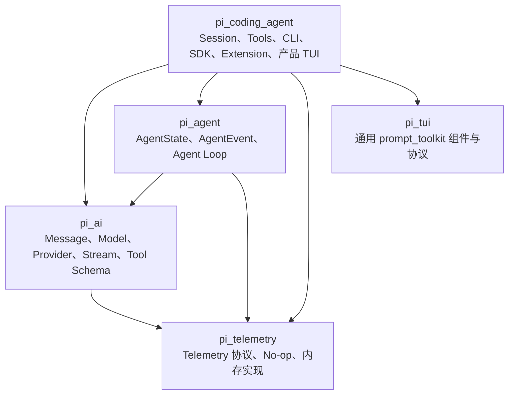
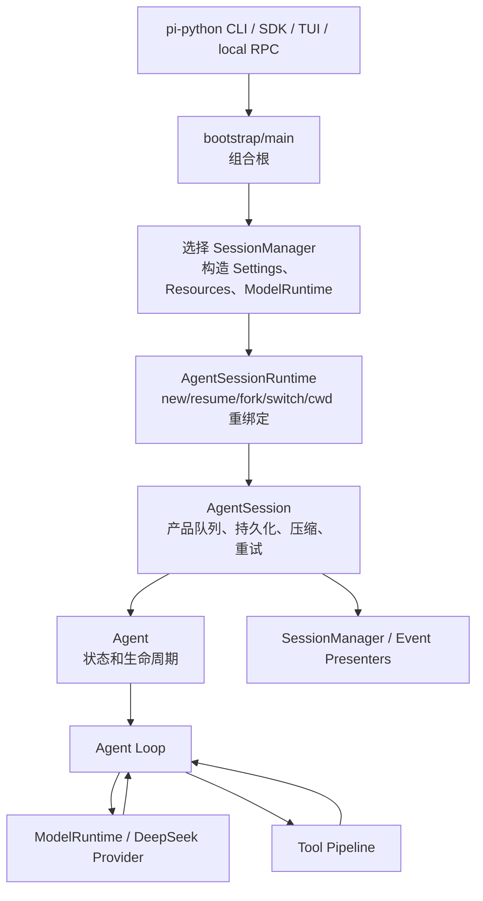

# Pi Agent Python 重写实施计划

> 状态：P0–P13 与 P14-T01..T10 已完成；下一项是 P14-T11。P12 起按“功能闭环优先”路线执行。
> 上游源码：`D:\pi`
> 冻结提交：`e14afc648e10fb6c527ea88fa627091ada764306`
> 上游版本：`0.84.1`
> Python：`>=3.12`
> 本文是项目范围和阶段验收的事实来源；原子执行任务见 [todo.md](todo.md)。

## 1. 权威顺序与目标

当资料冲突时，固定采用以下顺序：

1. `D:\pi` 冻结提交中的当前源码与测试。
2. 冻结提交 `e14afc648e10fb6c527ea88fa627091ada764306` 和版本 `0.84.1`。
3. Pi Agent 教程仅解释设计动机。教程基于较早的 `v0.80.2`，其中 Python 页面不是可执行规范。
4. Python 依赖与外部协议采用实施时核验的官方文档，并以 ADR 记录会改变行为的更新。

目标是在不复制上游 TypeScript 实现的前提下，以 Python 重新实现相同的关键产品行为、数据契约和模块边界。源码证据决定兼容行为；Python 惯用设计决定内部写法。

## 2. 已纠正的架构事实

- `AgentSession` 持有 `Agent`；`AgentSessionRuntime` 管理 new/resume/fork/switch 以及 cwd-bound 服务重建。
- `main/bootstrap` 是真正的组合根，SDK factory 复用同一组合路径。
- 成熟的同步 v3 `SessionManager` 与实验性 Harness、lanes、SQLite、远程协议相互独立；实验性部分不进入 1.0。
- Provider 单请求重试与 `AgentSession` 整轮重试是两个可观测、独立计数的层级。
- v3 Session 只在 Header 中使用 `version: 3`；Event 和普通 Entry 不增加 `schema_version`。
- `read` 截断后只保留头部并提示 offset；仅 Shell 输出累积器保存截断前的完整输出。
- 通用 TUI 不依赖 Agent/AI；Agent-aware renderer 位于 `pi_coding_agent`。
- 1.0 不承诺崩溃后恰好一次副作用。恢复未配对 Tool Call 时只追加一次错误结果，绝不重放工具。

## 3. Python 包边界

一个 distribution、一个根 `pyproject.toml`、一个 `uv.lock`：

```text
src/
├── pi_telemetry/
├── pi_ai/
├── pi_agent/
├── pi_tui/
└── pi_coding_agent/
```


```mermaid
graph TD
    TEL["pi_telemetry<br/>Telemetry 协议、No-op、内存实现"]
    AI["pi_ai<br/>Message、Model、Provider、Stream、Tool Schema"]
    AG["pi_agent<br/>AgentState、AgentEvent、Agent Loop"]
    TUI["pi_tui<br/>通用 prompt_toolkit 组件与协议"]
    CA["pi_coding_agent<br/>Session、Tools、CLI、SDK、Extension、产品 TUI"]

    AI --> TEL
    AG --> AI
    AG --> TEL
    CA --> AI
    CA --> AG
    CA --> TEL
    CA --> TUI
```

硬性依赖规则：

- `pi_telemetry` 不导入其他项目包。
- `pi_ai` 只可导入 `pi_telemetry`。
- `pi_agent` 只可导入 `pi_ai`、`pi_telemetry`。
- `pi_tui` 不导入任何其他 `pi_*` 包（包括 `pi_telemetry`）；产品 telemetry 只在组合根 `pi_coding_agent` 接入。
- `pi_coding_agent` 是产品组合层，可以导入其余四个包。

## 4. 运行链路与所有权


```mermaid
flowchart TD
    E["pi-python CLI / SDK / TUI / local RPC"]
    B["bootstrap/main<br/>组合根"]
    S["选择 SessionManager<br/>构造 Settings、Resources、ModelRuntime"]
    R["AgentSessionRuntime<br/>new/resume/fork/switch/cwd 重绑定"]
    AS["AgentSession<br/>产品队列、持久化、压缩、重试"]
    A["Agent<br/>状态和生命周期"]
    L["Agent Loop"]
    M["ModelRuntime / DeepSeek Provider"]
    T["Tool Pipeline"]
    P["SessionManager / Event Presenters"]

    E --> B --> S --> R --> AS --> A --> L
    L --> M
    M --> L
    L --> T
    T --> L
    AS --> P
```

一次请求的数据流：

```text
用户输入
→ AgentMessage
→ transform_context
→ convert_to_llm
→ pi_ai.Message / Context
→ DeepSeek 流
→ AssistantMessageEvent
→ AssistantMessage
→ ToolCall
→ prepare_arguments
→ Pydantic 参数校验
→ before_tool_call
→ execute
→ after_tool_call
→ ToolResultMessage
→ 追加到 Agent Context
→ 再次调用模型
→ 最终 AssistantMessage
```

## 5. 公共契约原则

### 5.1 类型

- 内部公共领域对象：带 `Literal` 判别字段的 dataclass。
- JSON、RPC、配置、Session 和工具参数边界：Pydantic v2。
- wire 输出使用 alias 保持 TypeScript 兼容 camelCase；Python API 使用 snake_case。
- Provider、Tool Operations、CredentialResolver、ResourceLoader、UI bridge 使用 `Protocol`。
- Provider 和 Agent Event 流使用 `AsyncIterator`。
- 成熟 SessionManager 保持同步；产品层用 `asyncio.to_thread()` 包装耗时整文件操作。

### 5.2 主要接口

- `pi_ai`：Message、Context、Model、Tool、AssistantMessageEvent、AssistantStream、Provider、CredentialResolver、FakeProvider。
- `pi_agent`：AgentMessage、AgentState、AgentEvent、AgentTool、Agent、`run_agent_loop()`。
- `pi_coding_agent`：SessionManager、AgentSession、AgentSessionRuntime、ModelRuntime、`create_agent_session()`、同步 SDK、Extension API。
- `pi_tui`：Component、Dialog、Overlay、Editor、Theme、Terminal Adapter 协议及 prompt_toolkit 实现。
- `pi_telemetry`：TelemetryContext、NoopTelemetry、InMemoryTelemetry。

### 5.3 错误

- 预期 Provider 网络/API 错误转换为终止 `error` 流事件。
- 取消转换为 `aborted`，不自动重试。
- 未知工具、参数非法、工具执行失败转换为 `ToolResultMessage(is_error=True)`。
- Session 损坏、配置非法、扩展加载失败使用明确 typed exception。
- 框架不变量或编程错误不伪装为 ToolResult，测试中直接失败。
- CLI 参数错误退出 `2`；配置/Provider/Session 运行错误为 `1`；成功为 `0`；用户中断为 `130`。
- text/JSON/RPC 输出不得含 traceback、Authorization header 或密钥。

详细 wire 契约、错误语义和兼容表位于 `docs/contracts/` 与 `docs/compatibility/`。

## 6. Python 1.0 范围

### 6.1 必须支持

- DeepSeek V4 Flash/Pro 流式 text、thinking、tool call、usage，默认 Pro。
- FakeProvider 和完整 Agent Loop。
- `read/write/edit/bash/grep/find/ls`。
- Windows/Linux 默认 Bash；PowerShell 作为随包提供且默认关闭的 Python Extension。
- 同步 v3 Session JSONL、树、fork、resume、import/export、compaction、branch summary。
- CLI text/JSON/交互模式及本地 stdin/stdout JSONL RPC。
- 异步 SDK 与同步便利封装。
- Settings、Prompt、Skill、Theme、上下文文件和项目资源信任。
- Python-native Extension 的工具、命令、flags、快捷键、Provider、认证交互、hooks、renderers、session actions 和 UI。
- local/Git/PyPI Python 包，以及 npm Pi Package 中的纯数据资源。
- prompt_toolkit TUI 的功能和动作语义对齐。
- HTML export、文本剪贴板、文件/图片附件数据契约。
- 默认关闭的逐工具权限 Extension。
- 可从干净环境安装和运行的 wheel；正式 GitHub Release、签名、SHA-256 清单与构建证明延后到发布阶段，不阻塞功能完整里程碑。

产品路线分为三个里程碑：

- **Pi 功能完整**：完成 Phase 12–17。CLI、SDK、TUI、Package、Extension 与本地 RPC 共享同一产品链，所有主要能力有真实端到端路径。
- **Codex 式本地能力完整**：再完成 Phase 18–20。增加 MCP Host、child agent、后台任务和 worktree task runtime；这些能力采用“核心拥有生命周期，Package 提供策略与 UI”的边界。
- **发布就绪**：最后完成 Phase 21。补齐安全审计、跨平台 CI、覆盖率、制品证明与正式 1.0 发布。

### 6.2 明确差异

- 命令名是 `pi-python`，不覆盖上游 `pi`。
- 全局配置 `~/.pi-python/agent`，项目配置 `.pi-python/`。
- `.pi/` 只在显式兼容模式下只读挂载或选择性导入。
- 内建 Provider 只有 DeepSeek；其他 Provider 由 Extension 注册。
- 内核不保存凭据；DeepSeek 使用 CLI/env/.env，Extension 自行实现认证持久化。
- 不执行 JS/TS Extension。
- TUI 不追求上游自研渲染器的逐像素一致。
- DeepSeek 不支持图片时在请求前明确拒绝；不实现 Kitty/iTerm2 图片协议。
- macOS 明确不支持。
- 损坏 v3 文件采用比 TypeScript 更严格的拒绝策略。
- 默认与 Pi 一样没有核心 sandbox；权限门是默认关闭的可选扩展。
- Python 原创代码暂不授权；上游材料的 MIT 声明放在 `THIRD_PARTY_NOTICES.md`。

### 6.3 Post-1.0

- Harness、operation records、lanes、v4 repository。
- SQLite Session 后端。
- 实验性 protocol/client/server 与远程 Session。
- 内建多 Provider、内建 OAuth、凭据仓库。
- Node sidecar/TS Extension 执行。
- 终端图片协议与 macOS 支持。

### 6.4 完成 Pi 后与 Codex 的产品差距

Phase 17 得到的是功能完整的本地 Pi Python，而不是完整 Codex。用户已明确要求扩大功能范围，因此以下本地能力进入 Phase 18–20；桌面/云产品仍保留在更远路线：

1. **MCP 与外部工具生态**：先实现 MCP client transport、server lifecycle、tool/resource/prompt 映射与断线恢复；web、数据库、浏览器等能力优先作为 MCP server 接入，不在核心重复实现。
2. **subagent、后台任务与工作树隔离**：在 `AgentSessionRuntime` 之上增加 child task、状态/事件聚合、取消、资源预算和 Git worktree ownership；不要把 subagent 直接塞进单个 Agent Loop。
3. **权限、sandbox 与变更审阅**：为公开分发增加 OS 级进程/文件边界、可配置审批策略、命令允许表、diff/patch 预览和提交前 review；这是 Codex 级安全体验，不是 Pi 功能闭环前置。
4. **桌面/云协作产品**：任务列表、持久后台执行、跨设备同步、浏览器/终端/review 面板、团队权限和远程执行属于独立产品层，应复用 RPC/MCP，不污染本地 Agent 内核。
5. **模型与多模态广度**：保持 Provider Extension 接口，按需增加 OpenAI/Anthropic 等 Provider、图片理解和更丰富输入；模型目录扩展不应改变 Agent/Session 契约。

实现边界固定为：Package 只负责安装、配置、能力声明和 UI；Extension 负责注册工具、命令、Provider 与 hooks；连接、进程、并发、取消、持久化、cwd/worktree ownership 和资源释放由核心 Host 服务负责。MCP 最先实现；subagent 依赖稳定的 shared bootstrap、RPC 和 lifecycle，因此必须在 Phase 15–16 之后；桌面/云产品最后再做。

## 7. 阶段路线图

每个 Phase 使用短分支 `phase/NN-name`；每个任务一个可观察行为和一个提交。Phase 完成后创建 PR，并在用户验收前停止。Phase 0 的 main bootstrap 是唯一允许直接推 main 的例外。

### Phase 0：规范、审查基线和测试底座

实现：

- 归档旧 plan/todo，替换为本计划和可执行原子任务表。
- 建立 surface matrix；每项只允许 Supported、Intentional divergence、Post-v1。
- 冻结 Message/Event/Tool/Session v3/错误/路径/命名/兼容契约。
- 建立 threat model。
- 初始化单 wheel、Hatchling、uv、Ruff、Pyright strict、pytest 和 CI。
- 提供 FakeClock、FakeProvider、FakeTool、isolated home、临时 workspace、网络禁用 fixture。
- 提供只读 TypeScript oracle；不得对 `D:\pi` 运行修改型检查。
- `.env.example`、`.gitignore`、本地与 CI secret scan。
- `THIRD_PARTY_NOTICES.md` 写明上游 MIT 与冻结 commit；不创建根 LICENSE。

验收：冻结同步、lint、format、type、offline test、build 和 secret scan 全部通过。首次推送 main 后启用 required checks 与禁止直接推送。停止并等待用户验收。

### Phase 1：`pi_telemetry` 与 `pi_ai` 基础原子

先以独立依赖任务把 Pydantic v2 写入 `pyproject.toml` 与 `uv.lock`，再实现 No-op/InMemory telemetry；Message/content/image/tool/context/model/usage/thinking 类型；12 类 Assistant 流事件；Provider、AssistantStream、FakeProvider；codec/schema；CredentialResolver 协议。

验收：wire round-trip；text/thinking/tool/multiple/error/abort 顺序；schema 成败矩阵；完全离线和确定性。

### Phase 2：`pi_agent` 与核心循环

实现 AgentMessage 与 LLM Message 分层、内部消息、`transform_context()` 后 `convert_to_llm()`、AgentState/Event/Tool/Agent、五步工具流水线、顺序/并行调度、steering/follow-up 双队列、监听/取消/并发防护。

验收：无工具到多轮链路；错误矩阵；abort/length/terminate/max rounds；队列顺序；`wait_for_idle()` 等待 Agent 与异步 listener。

### Phase 3：稳定产品契约与 v3 Session 基础

实现完整 v3 Header 与当前 Entry；extra/custom 保留，未知 type 拒绝；同步 SessionManager；append-only tree/leaf/branch/fork/delayed creation；纯读 open/list/export；原子整文件写；严格损坏检测；提供只读来源、写入新 `.pi-python` 文件的成熟 v3 `import-pi-session` 服务；冻结 Settings/Resource/Extension/UI/SessionImporter Protocol 与 no-op 实现。

验收：TypeScript/Python 合法 v3 双向兼容；追加不改旧行；导入不改来源字节；状态恢复；损坏失败且文件字节不变；独立 checkpoint 任务更新 `pyproject.toml`、`uv.lock`、`CHANGELOG.md`，从仓库外安装 wheel 并 smoke；用户确认后才 tag/release `0.1.0`。

### Phase 4：DeepSeek Provider

先以独立依赖任务把固定版本 `openai`（`AsyncOpenAI`）写入 `pyproject.toml` 与 `uv.lock`，再实现 `max_retries=0`、仅流式 chat completions、Flash/Pro 目录、thinking/tool partial JSON/usage/stop、凭据优先级、仅在尚无语义 delta 时的有限请求重试、300 秒 idle timeout。

验收：Mock SSE 覆盖正常、429、5xx、timeout、partial JSON；默认无 Key/无网络；live smoke 另行获得批准。

### Phase 5：Coding Tools

实现 Operations Protocol 与七个工具；Windows Bash 发现；read/shell 各自截断语义；edit 原子匹配；BOM/换行保留；canonical path mutation queue；系统优先 rg/fd 与受校验下载；保持上游宽权限默认值。

验收：Unicode/长行/BOM/CRLF/symlink；shell exit/timeout/abort/process tree；无迟到污染；批次顺序稳定。

### Phase 6：可运行的无头产品切片

实现 bootstrap/main、AgentSessionRuntime、AgentSession、ModelRuntime/provider factory、异步/同步 SDK、首版 CLI，以及恢复未配对 Tool Call 的一次性错误结果策略。

验收：仓库外 wheel 可运行；FakeProvider CLI 黑盒；`import-pi-session` CLI/SDK 黑盒；经批准的 DeepSeek smoke；独立 checkpoint 任务更新版本与 changelog、仓库外 wheel smoke，用户确认后才 tag/release `0.2.0`。

### Phase 7：Settings、Prompt、Skill、Theme 与 Resource Discovery

实现全局/项目目录、环境变量兼容、资源优先级、只读 `.pi` adapter、选择性导入、project trust、context/system prompt/templates/skills/theme descriptors。此阶段不执行 Extension。

验收：优先级矩阵；未信任无代码执行/安装；兼容源只读；Skill/XML/懒加载；上下文顺序确定。

### Phase 8：AgentSession 高级行为

实现产品 Event 分层、整轮 retry、retry 状态与取消、overflow 分离、manual/auto compaction、增量摘要、branch summary/LCA/文件跟踪、model/thinking 恢复和 tree view。

验收：retry 成功/耗尽/取消/工具后重试；总尝试精确；切点不在 ToolResult 中间；overflow 最多恢复一次；fixture 对齐；独立 checkpoint 任务更新版本与 changelog、仓库外 wheel smoke，用户确认后才 tag/release `0.3.0`。

### Phase 9：通用 `pi_tui`

先以独立依赖任务把固定版本 `prompt_toolkit` 写入 `pyproject.toml` 与 `uv.lock`，再实现 Terminal Adapter、通用组件、regular/fullscreen、resize/history/undo/paste/autocomplete、CJK/emoji/ANSI 宽度、动作和替代键、MemoryTerminal/pipe input。

验收：多尺寸/resize；stream 无残影；输入焦点行为；Windows/Linux CI；依赖边界仍成立。

### Phase 10：Extension 与 Pi Package

实现 trust 后 import、统一 await hooks、完整注册面、扩展自有认证持久化、local/Git/PyPI 包、托管环境/锁文件、npm `pack --ignore-scripts` 数据资源、DefaultResourceLoader、hot reload/teardown/lifecycle，以及默认关闭的 permission-gate 与 PowerShell 扩展。

验收：未信任不 import；第三方异常隔离；包锁定/update/offline/hash；npm scripts 禁止；dynamic flags 两阶段解析；独立 checkpoint 任务更新版本与 changelog、仓库外 wheel smoke，用户确认后才 tag/release `0.4.0`。

### Phase 11：交互式 Coding Agent TUI

实现 Agent-aware renderers、Session selector/tree/fork、model/thinking/settings selector、slash/Skill/Prompt/Extension UI、regular/fullscreen、剪贴板、附件契约与图片 capability error。

验收：完整 FakeProvider 交互；stream/tool/compaction/switch/dialog；中文/CJK/emoji；Windows 真终端 smoke；独立 checkpoint 任务更新版本与 changelog、仓库外 wheel smoke，用户确认后才 tag/release `0.5.0`。

### Phase 11.5：产品级补全（Codex / Claude Code / 上游 Pi 对齐）

依据 `docs/current-agent-validation.md` §18–§20 的源码与真实运行差距审计，在进入 Phase 12 前补齐已确认的产品级缺口。能力组到原子任务的映射（能力组不并入单个提交）：

| 能力组 | 原子任务 |
|---|---|
| grep/find/ls 生产接线与 readonly 工具集 | P11.5-T01、P11.5-T02 |
| CLI 工具 allowlist/denylist/default/disable 开关 | P11.5-T03、P11.5-T04 |
| token 估算、threshold 自动压缩、/compact 与 JSON compaction 事件 | P11.5-T05、P11.5-T06（JSON compaction 事件已在 Phase 11 修复中落地） |
| read 图片、vision 模型、附件端到端和相关 ADR | P11.5-T07、P11.5-T08、P11.5-T09 |
| edit diff/patch/firstChangedLine、分级模糊匹配和 TUI diff 摘要 | P11.5-T10、P11.5-T11、P11.5-T12 |
| bash PI_* 环境、commandPrefix、binDir PATH、流节流 | P11.5-T13、P11.5-T14 |
| Session 命名、修复、打开即创建 | P11.5-T15、P11.5-T16、P11.5-T17 |
| 工具描述截断说明 | P11.5-T18 |
| 真实 API、ConPTY、Session、二进制下载验收 | P11.5-T19（阶段验收轮） |

差距项分类裁决（逐项，不以"与 Codex/Claude Code 完全相同"为标准，以冻结上游 Pi 表面 + surface matrix 为准）：

- **1.0 必须实现**：grep/find/ls 生产接线、readonly 工具集、工具开关 flags、`defaultTools`、threshold 自动压缩、`/compact`、vision 模型目录 + read 图片 + 附件端到端、edit diff/模糊匹配/TUI diff 摘要、bash PI_* 与 shellCommandPrefix、binDir PATH、流节流、`--name`、session repair、打开即创建、工具描述截断说明。
- **Intentional divergence**（记录于 ADR/矩阵既有行）：核心沙箱与逐工具审批（TOOL-010 既有行，与上游一致，permission gate 默认关闭扩展已随包）；bash `spawnHook` 选项（Python 等价能力由 EXT-005 tool_execution hooks 提供，不复制该构造参数）；`app.clipboard.pasteImage` 图形剪贴板二进制读取（P11-T06 已定 divergence：附件走文件路径契约，OSC-52 只写不读）；鼠标支持（上游 alt-screen 有 mouse，冻结矩阵无 mouse action 行，pi_tui 不做鼠标）；`lastChangelogVersion`/`collapseChangelog` 键（settings 读取层已兼容接受，无上游自动更新 UI 行为）；Session 大文件 O(n·depth) 全量校验（可接受边界，见下）。
- **Post-v1 分类、现已排期**：MCP client、subagent、后台任务和基于 MCP 的 web 搜索（均非冻结上游 Pi 表面，保持矩阵 `Post-v1` 分类，但已进入 Phase 18–20）；**仍未排期**：`@`-mention 交互补全 UI（`@file` 数据路径由 P17-T01 提供）与 constrained sampling。
- **误报**（上游/源码证据）：持久输入历史（上游 editor 历史同样仅在内存，无持久化文件）；图片粘贴缺失（附件契约与 `/attach` 图片路径已存在，缺的是 vision 模型目录，由 P11.5-T07/T08 补齐）。

Session 审计边界补充：catalog cwd 过滤在 Windows 盘符大小写与目录改名场景的行为、UNC/相对 cwd 编码，在 P11.5-T17 一并以测试固定；大 Session 全量载入 + 双重校验的成本边界记录于 ADR 0003 附录，不做流式重写。

验收：Phase 11.5 全部任务原子提交；真实验收轮（P11.5-T19）覆盖 `--tools all` 真实 grep/find/ls、降低阈值自动压缩、vision 读真实截图、智能引号/NFKC edit、撕裂行 repair、ripgrep/fd pinned 下载 SHA256 校验、DeepSeek headless、JSON、regular TUI 多轮。

### Phase 12：共享产品组合主干

先建立所有后续能力共同依赖的组合根。保留已经开始的 P12-T01，只把它限定为静态 CLI 参数、子命令和 Extension 未知 flag 的第一阶段解析；不在一个任务中实现所有命令行为。随后把 Settings、project trust、ResourceLoader、PackageManager、ExtensionRuntime、ModelRuntime、Tools、SessionManager 组合成唯一 runtime factory，并让 CLI、SDK、headless/TUI 以及 Session new/resume/fork/switch 复用它。

验收：同一 fixture 通过 SDK、headless CLI 和 TUI 获得相同 Settings、资源、工具和 Extension descriptors；Session 切换到不同 cwd 后旧服务关闭、新服务重建；不存在“SDK 可用但 CLI 不可用”的默认接线分叉。

### Phase 13：Pi Package 与资源闭环

按纵向切片实现 Package，而不是先铺满所有来源。顺序为：本地 Package 安装并持久化 → Package 内 Skill/Prompt/Theme 被 ResourceLoader 发现 → list/config/remove → Git/PyPI → npm 纯数据 → update/offline → CLI 完整命令。Package 是资源分发层；一次安装必须能够在重启后影响真实 Agent/TUI，而不仅是生成锁文件。

验收：一个本地黄金 Package 可被 `install`，重启后 Skill/Prompt/Theme 仍可用，config 可启停，update 可替换，remove 后不再发现；Git/PyPI/npm 与 offline 分别有确定性 fixture；失败安装不破坏旧版本；最终通过真实 DeepSeek API 和真实 TUI 进程完成多轮资源驱动任务，而不是以 SDK/AgentSession 代替 TUI。

### Phase 14：Python Extension 完整运行时

把已有 loader、registry、HookRunner、UI/Auth ports 和 lifecycle 接进 AgentSession。显式 CLI Extension 与用户主动安装的全局 Package 直接按用户意图加载；项目 Extension 只受 project trust 控制，避免再建立一套没有产品入口的临时 `grant_trust()` 状态。先完成 Tool/Command/Provider 的正常产品路径，再分组接入 Agent/Turn/Message、Tool、Context/Provider、Session 事件与 actions，最后接动态 flags、shortcuts、UI、renderers、reload 和 stale-context 处理。纳入最新 Pi 增量：`ui_prompt_start`/`ui_prompt_end`、全量工具注册表与 active tool 集合、纯增量动态工具激活、deferred-tool 元数据及普通 Provider 回退；Extension 创建的长生命周期资源必须登记 teardown。

验收：黄金 Extension 通过正常 CLI/Package 路径注册 Tool、Command、Provider、Flag、Skill 和 hook；Agent 实际调用扩展 Tool，TUI 执行扩展 Command，Provider 可选；new/fork/switch/reload 后旧 generation teardown 且事件不再触发，失败 Extension 不影响其他 Extension；最终使用真实 DeepSeek API 驱动真实 TUI 进程调用扩展能力并完成多轮任务。

### Phase 15：CLI、TUI 与本地 RPC 完整产品模式

在共享 bootstrap 和完整 Extension runtime 上完成用户入口。先完成动态 help/flags、Package/trust/offline 命令和 Extension commands，再实现 strict-LF JSONL RPC schema、server、完整 AgentSession commands、Extension UI bridge 与 Python RpcClient。RPC 只是同一 AgentSession 的另一种适配器，不拥有第二套业务逻辑；包含最新 Pi 的 `clear_queue`，并允许长时间工具使用调用方可控超时而不是固定 60 秒。

验收：同一 Session 可通过 CLI/TUI/RPC 执行 prompt、steer、abort、tool、compact、model、fork/switch 和 Extension UI；RPC stdout 只含协议帧，慢消费者有界；RpcClient 正确处理乱序 response/event、退出与清理。

### Phase 16：功能可靠性与上游语义差分

把原计划中最有价值的 P13 内容提前：TypeScript/Python 语义差分、历史 regression 和黄金 Package/Extension 端到端测试。差分比较事件顺序、状态变化和可观察结果，不比较时间、ID、绝对路径或模型自然语言。使用本地 FakeProvider、临时 Git/PyPI/npm fixture 和 subprocess/PTY，避免把 mock 单元测试当成产品可用证明。最新 Pi 增量回归至少覆盖：JSONL 尾行无换行恢复、Extension 插入消息不拆开 ToolCall/ToolResult、大工具结果在下一 Provider 请求前自动压缩、并行工具结果逐个持久化、Extension/MCP 子进程在 reload/退出时清理。

验收：黄金 Package 覆盖 install → restart → Agent 调用扩展 Tool → TUI Command → Session switch/reload → RPC → update → remove；冻结上游核心场景语义 diff 通过；已确认历史问题每项有独立 regression。

### Phase 17：次要但属于 1.0 的产品表面

最后补齐不阻塞 Agent/Extension 主链的表面：`@file` 参数、文本/图片附件统一输入、HTML export、文档化帮助与必要的剪贴板适配。它们复用 Phase 12 的 bootstrap、Phase 14 的 renderers 和 Phase 15 的 RPC，不再产生独立实现。

验收：CLI/SDK/TUI/RPC 对同一附件生成一致消息；HTML export 可读取真实 Session 并应用 Extension renderer；帮助、README 和实际 subprocess 输出一致。完成 Phase 17 即达到“功能完整”里程碑，可作为本地完整 Pi Python 产品使用。

### Phase 18：MCP Host 与外部工具生态

在 `ProductRuntime` 下增加核心 `McpHost`，统一拥有 stdio/HTTP/SSE 连接、Server 子进程、重连、取消、超时、认证引用和 teardown。MCP Server 配置、特定适配、工具选择策略与 UI 通过 Package/Extension 提供。工具目录使用 Phase 14 的全量 registry + active set：默认只激活搜索/加载工具，按需增加匹配的 MCP 工具，避免每轮发送全部 schema。Web、浏览器、数据库等不在 Agent Loop 内重复实现，优先通过 MCP Package 接入。

验收：本地 fixture MCP Server 可经 Package 安装、启动、发现 Tool/Resource/Prompt、动态激活并由真实 Agent 调用；abort、reload、Session switch 和进程退出均不遗留 Server；断线和超时产生结构化错误且下一轮可恢复。

### Phase 19：Child Agent 与后台任务

在共享 runtime factory 上提供核心 `ChildAgentHost` 与持久 `TaskRegistry`。child 默认隔离历史，只显式继承 model/auth/tools/cwd；统一限制递归深度、并发数、token/时间/输出预算，并聚合状态、事件、usage、取消和失败。Package 定义 explorer/reviewer/tester 等角色、提示词、命令和 TUI；不得以裸 `pi --mode json` 子进程作为唯一产品契约。

验收：父 Agent 可启动、观察、取消和等待单个或并行 child task；失败/超时不是普通成功 ToolResult；重启后任务状态可恢复；输出、token、成本和递归均有界；RPC 与 TUI 看到同一任务状态。

### Phase 20：Worktree Task Runtime 与本地编排

worktree 必须在 SessionManager、ResourceLoader、ExtensionRuntime 和工具创建前建立。核心拥有 create/reuse/cleanup、base ref、dirty-state 策略和 task ownership；ChildAgent/TaskRegistry 只接收已经解析的 workspace context。Package 可提供工作流和策略，但不能在 Extension 激活后偷偷切换进程 cwd。

验收：一个父任务可在独立 worktree 中运行 child 完整任务，不污染父 checkout；Session、资源、工具和 Git 状态全部指向 worktree；取消、失败、重启和清理都有确定状态，未合并工作不会被自动删除。

### Phase 21：安全、跨平台与正式发布（低优先级）

在本地功能阶段完成后再处理威胁/依赖/secret 审查、跨平台 CI、coverage 门、全新 HOME wheel 安装、Release artifacts/attestation、Flash/Pro live smoke 和 1.0 发布。此阶段不新增核心产品能力，只证明可分发、可审计和可恢复。

验收：所有静态/离线 CI 全绿；Windows/Ubuntu × 3.12/3.13；关键模块 branch coverage ≥90%；surface 每一行都链接到实现测试或明确 Post-v1；发布 `0.9` RC，用户验收后再发布 `1.0`。

## 8. 全局测试与安全门

默认测试：

- 在 test collection 前隔离 HOME、cwd、API Key、用户配置、缓存和 Git 全局影响。
- 默认阻断 Python socket/DNS、Python child process 与常见 Python 网络客户端，并设置 offline proxy/env；这是可测试的 Python 进程边界，不宣称提供 OS 级任意原生进程防火墙。
- `network`/真实 Provider 测试必须同时显式 env opt-in 并使用独立 marker。DeepSeek 已获用户持续授权；其他真实 Provider 每次运行前仍需批准。
- 固定时钟、ID、随机数。
- 使用 FakeProvider 驱动 Agent/Session/CLI，避免 mock 内部实现细节。
- 对 API Key、Authorization header、`.env` 与错误 repr 做泄漏测试。
- 使用本地 pre-commit 与 CI secret scan；冻结 `uv.lock` 并审计依赖。
- 不运行会修改 `D:\pi` 的 formatter、check 或 codegen。

真实 Provider 验收轨（不属于默认测试门）：

- 测试位于 `tests/live/`，同时使用 `live_provider` 与 `network` marker，并要求 `PI_PYTHON_ALLOW_LIVE_PROVIDER_TESTS=1`、`PI_PYTHON_ALLOW_NETWORK_TESTS=1` 和 Provider 专用执行开关。
- DeepSeek 真实运行使用用户持续授权，不再逐次询问，但每项测试必须内建请求数、token、超时和总成本硬上限；其他真实 Provider 仍需对本次命令明确批准。
- 凭据只从进程环境或显式 `--env-file` 读取，不打印、不写报告、不复制到 fixture；失败输出也必须通过泄漏检查。
- 使用临时 HOME 和一次性 Git 项目，设置请求数、max tokens、超时和总成本上限；验证真实文件、测试结果、Session 记录和多轮行为，不断言模型自然语言完全一致。
- Phase 12 live 验收覆盖共享 bootstrap、真实工具调用、Session 延续和跟进修正；Phase 13 live 验收覆盖 Package 安装后 Skill/Prompt/Theme 在真实 TUI 进程中的多轮行为；Phase 14 live 验收覆盖 Extension Tool/Command/hook 在真实 TUI 中的调用。SDK/AgentSession 直连测试不能替代 Phase 13/14 的 TUI 验收。

Phase 21 正式发布阻断场景（不阻塞 Phase 17 Pi 功能完整验收）：

- 多工具并行完成、按模型顺序持久化。
- abort 后无迟到事件。
- edit 失败无部分写入。
- 恢复 unmatched Tool Call 不执行任何副作用且不重复补写。
- 合法 v3 双向兼容；损坏 Session 纯读失败且字节不变。
- new/resume/fork/switch 正确重建 cwd-bound 服务。
- project trust 前不加载扩展代码。
- JSON/RPC stdout 无日志污染。
- DeepSeek SDK/Provider/AgentSession 三层总请求次数可精确断言。
- wheel 在仓库外、全新 HOME 可运行。

## 9. Git、任务与发布规则

- `tasks/todo.md` 是唯一任务执行事实来源，不为每项建立 GitHub Issue。
- 一项任务只改变一个可观察行为；先红测，再最小实现，再聚焦验证和阶段回归。
- 预计主要文件限制为 1–5 个；不得顺手重构相邻模块。
- 分支：`phase/NN-name`；提交：`P<n>-T<nn>: ...`。
- Phase PR 必须列出测试、差异、风险和回滚；用户确认后才能合并和进入下一 Phase。
- Phase 0 初次 main bootstrap 是唯一一次直接推 main；其后 main 启用 required checks 与禁止直接推送。
- GitHub Release，不发布 PyPI。正式 release 含 wheel、sdist、SHA-256、构建证明。

## 10. 已锁定假设

- Python 3.12+；`asyncio`、Pydantic v2、argparse 两阶段解析、uv、Hatchling、Pyright strict。
- 0.x 可以通过 ADR 和迁移说明演进 API；1.0 后冻结。
- 上游 Pi commit 冻结到 Python 1.0；DeepSeek 目录更新使用独立 ADR、mock、live smoke 和单独提交。
- 默认无 sandbox、无逐工具确认；permission gate 默认关闭。
- `.env` 默认只读 cwd，可用 `--env-file` 指定。
- Windows/Linux 正式支持；macOS 拒绝。
- local RPC 属于 1.0；远程协议属于 Post-1.0。
- DeepSeek live API 测试使用持续授权和硬预算；其他 live API 测试必须在当次运行前获得用户批准。
